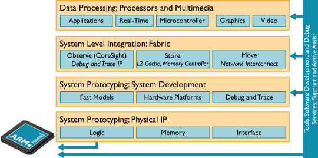
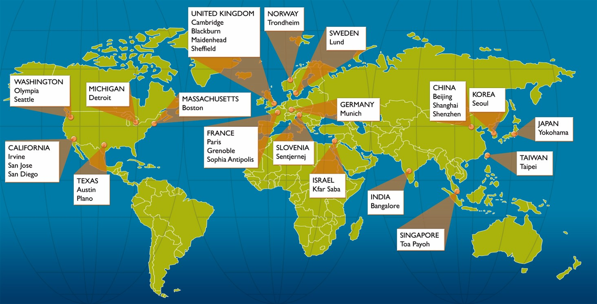
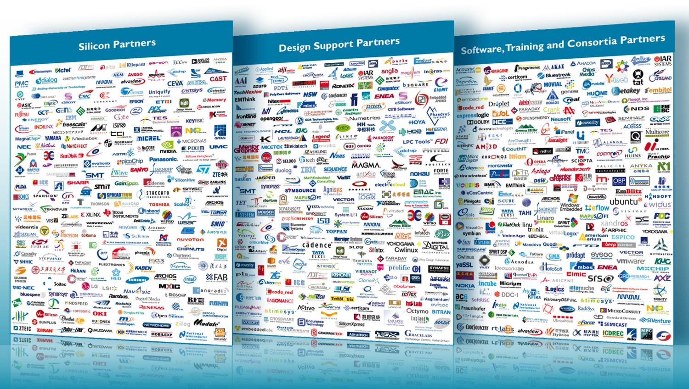
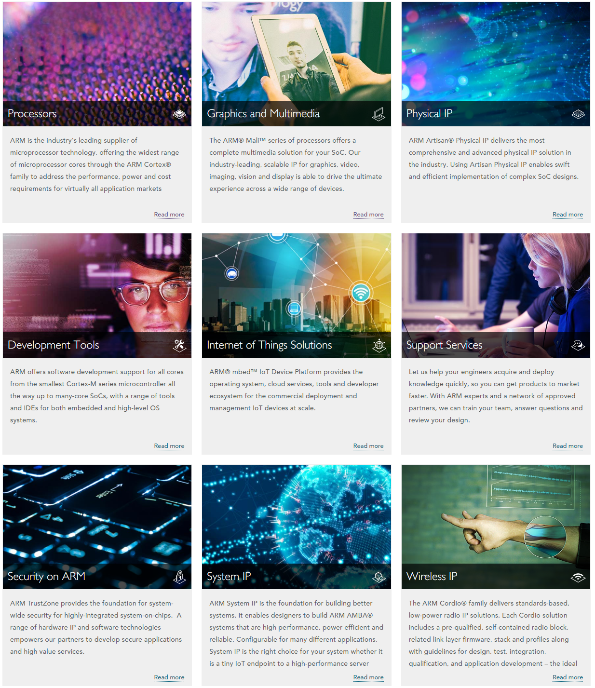
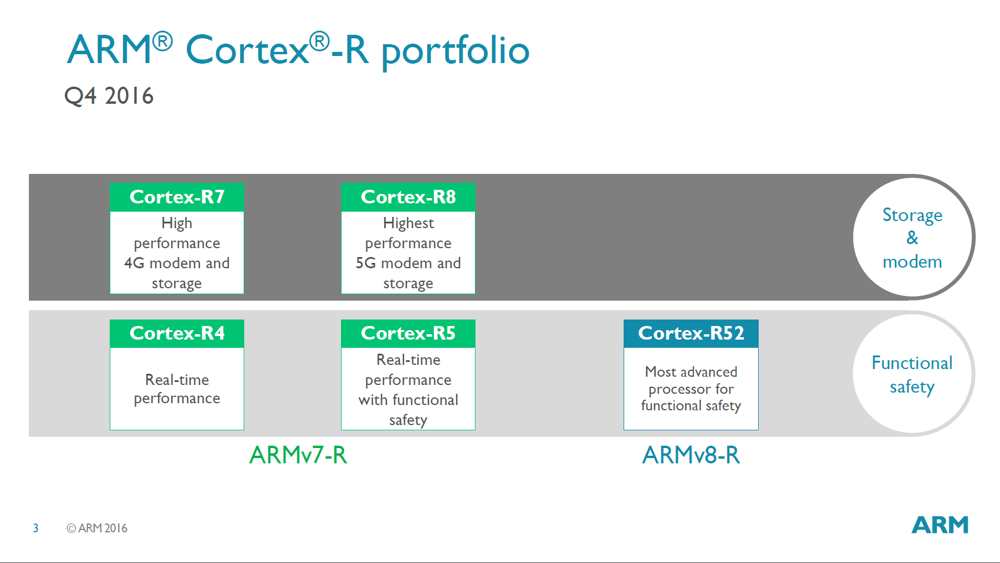
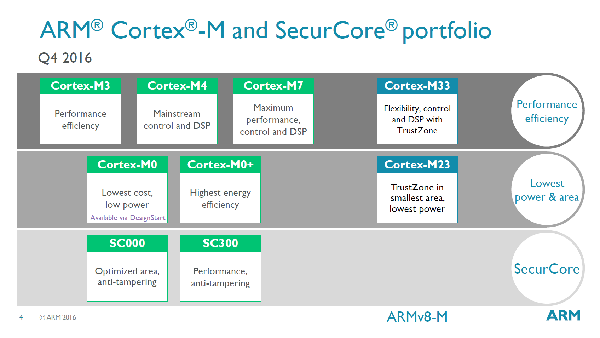
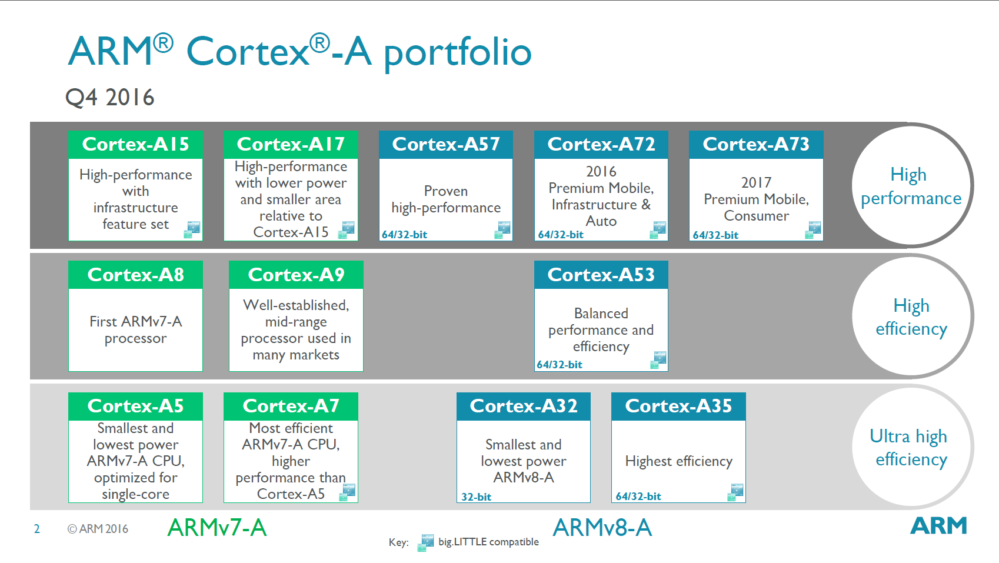
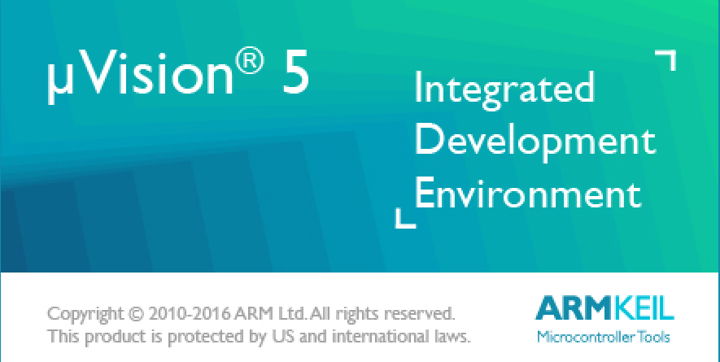
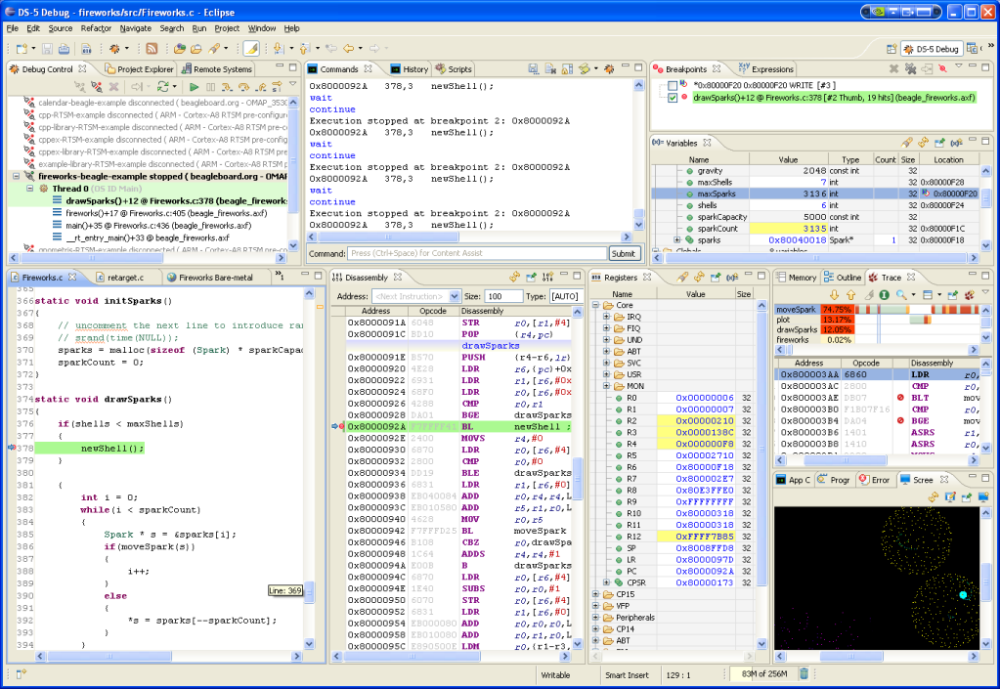

# ARM

## ARM 公司

ARM Holdings 是全球领先的半导体知识产权 (IP) 提供商，并因此在数字电子产品的开发中处于核心地位。
ARM 的总部位于Cambridge, 英国，拥有 2000 多名员工，并且在全球范围内设立了多个 办事处，
包括位于中国台湾、法国、印度、瑞典和美国的设计中心。

* 公司的几大亮点
* 全球领先的半导体 IP 公司
* 成立于 1990 年
* 目前为止已销售超过 200 亿个基于 ARM 的芯片
* 向 250 多家公司出售了 800 个处理器许可证
* 获得了所有基于 ARM 的芯片的版税
* 赢得了长期成长型市场的市场份额
* ARM 的收益增速通常要比整个半导体行业快

ARM 的商业模式主要涉及 IP 的设计和许可，而非生产和销售实际的半导体芯片。我们向合作伙伴（包括全球领先的半导体和系统公司）授予 IP 许可。
这些合作伙伴 可利用 ARM 的 IP 设计创造和生产片上系统设计，但需要向 ARM 支付原始 IP 的许可费用并为每块生产的芯片或晶片交纳版税。
除了处理器 IP 外，我们 还提供了一系列工具、物理和系统 IP 来优化片上系统设计。

*ARM 产品线：提供领先的设计、实现和应用*   

正因为 ARM 的 IP 多种多样以及支持基于 ARM 的解决方案的芯片和软件体系十分庞大，全球领先的原始设备制造商 (OEM) 都在广泛使用 ARM 技术，
应用领域涉及手机、数字机顶盒以及汽车制动系统和网络路由器。目前，ARM 技术已在 95% 的智能手机、80% 的数码相机以及 35% 的所有电子设备中得到应用。

## ARM 公司在全球的分布

## ARM 公司的合作伙伴

## ARM 公司的市场

## ARM 公司的产品

ARM公司的所有产品

## ARM公司的核心产品:处理器

* Cortex-R
* Cortex-M
* Cortex-A

### ARM Developemnt IDE - ARM程序开发工具

* Mircocontorller 微控制器 - [Keil 5](http://www.keil.com/)   

* Processor 处理器 - [DS-5](https://developer.arm.com/products/software-development-tools/ds-5-development-studio)   
