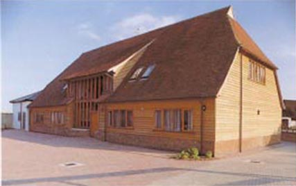
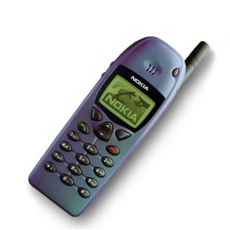
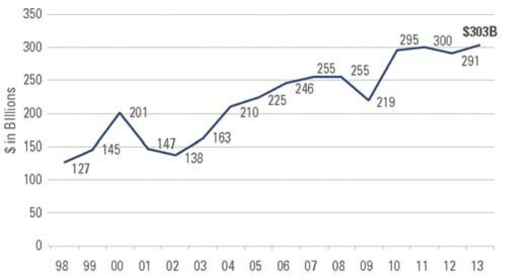
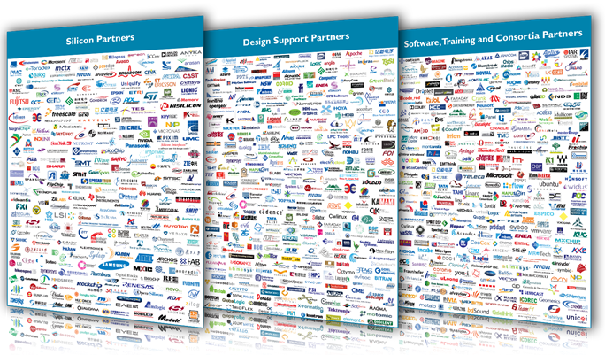
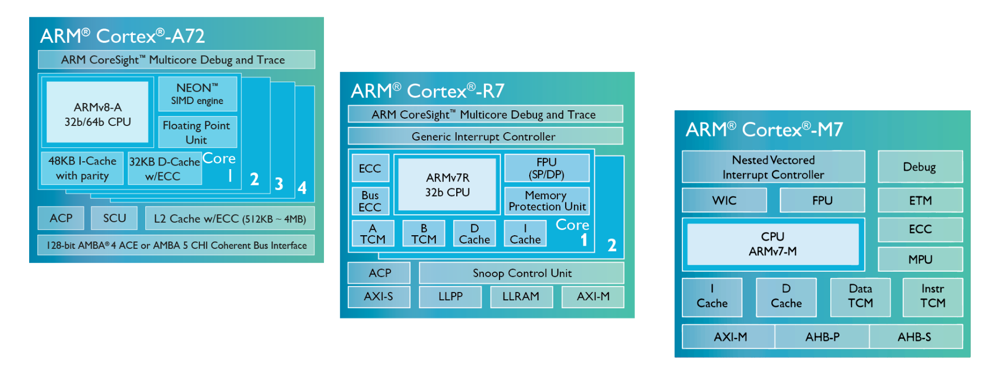
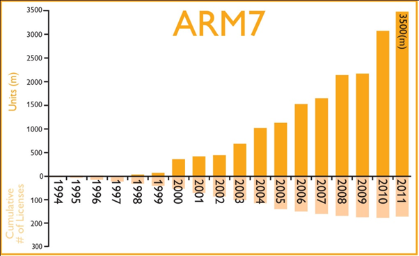
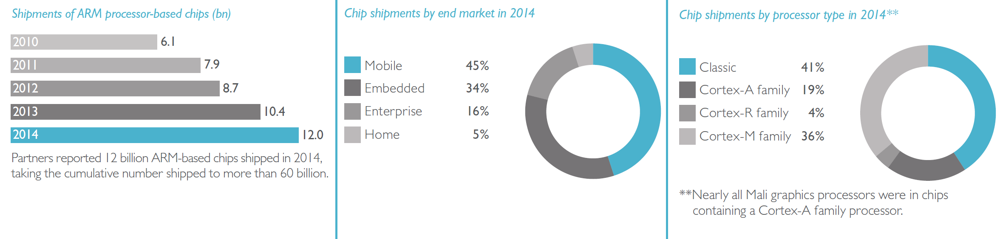
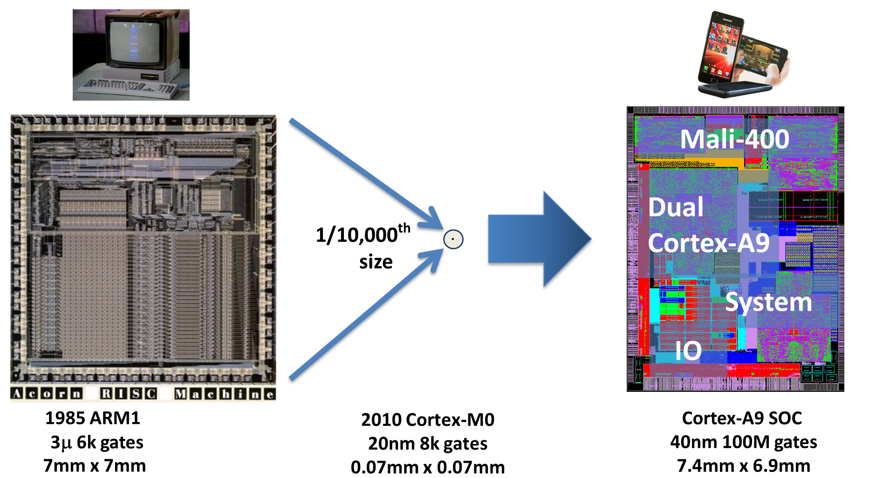

# ARM History

site:[原文](https://community.arm.com/cn/b/blog/posts/arm-924995701)

## 开始：Acorn计算机公司

任何一个30岁的英国人都很可能会记得Acorn计算机公司和大名鼎鼎的BBC Micro计算机（于1981年推出，搭载6502处理器。
Acorn的背景故事本身就十分有意思，也许值得专门为此写一篇博客。20世纪80年代正是计算机工业蓬勃发展的时期。
Acorn计算机公司的创始人是Christopher Curry和Herman Hauser。Chris Curry与Sinclair Radionics公司的Clive Sinclair亲密共事长达13多年。
后来公司遇到一些财政问题，Sinclair向政府求助，但这导致了其失去了Sinclair Radionics的完全控制权，
于是他创建了一家名叫Science of Cambridge的新公司（即后来的Sinclair研究公司）。Chris Curry就是这家新公司的主创人之一，
但是后来他与Sinclair在公司发展方向的问题上产生了分岐，便决定离开Sinclair计算机公司。

Curry很快与Herman Hauser成为了合作伙伴。Herman Hauser是一名奥地利籍的物理学博士。
他15岁在剑桥学习英文时喜欢上了那里，于是后来回到剑桥攻读博士。他们共同创办了CPU（Cambridge Processor Unit的缩写）公司，
产品包括用于赌博机的微处理器控制器，可以阻止精心策划的黑客通过赌博机牟取暴利。他们成立Acorn计算机公司作为CPU的商业名称，
并用于区分两家公司。之所以取名Acorn，显然是因为想在电话黄页上比Apple电脑公司更靠前！

一晃几年，他们获得了开发BBC Micro计算机的契机，这是一项让英国每间教室都拥有一台电脑的政府举措。
来自剑桥大学的才华横溢的计算机科学家Sophie Wilson和Steve Furber负责为Acorn自己的32位处理器设计微处理器，这是一项伟大的任务。
然而公司资源匮乏，因此设计必须精良简洁。Sophie负责ARM1的指令集开发，Steve负责芯片设计。首个ARM设计基于808行Basic代码。
引用Sophie在一次电传采访中说过的话：“我们事先很仔细地考虑各种因素，才得以完成这项任务。”
ARM（Acorn RISC Machine）的开发项目开始于1983年末或1984年初的某个时间。
第一个芯片于1985年4月26日递交给Acorn（当时正在研发我们现在所知的ARM2）。
1987年问世的Acorn Archimedes是第一台基于精简指令集(RISC)的家用电脑。

## ARM成立

ARM当时是Advanced RISC Machines（高级RISC指令集计算机）的缩写。然而如今当很多人再问起ARM代表什么，只能说ARM不代表任何东西。
虽然作为该名称起源的计算机早已过时，ARM公司却仍保留了这个名字。有意思的是，尽管如今这个名字不代表任何东西，ARM公司的徽标却十分醒目！

   
ARM徽标(2015)

公司成立于1990年11月，全名为Advanced RISC Machines Ltd，是由Acorn计算机公司、苹果计算机（即苹果公司）和VLSI Technology共同组建的合资公司。
苹果加入的原因是它想使用ARM的技术，却不想基于Acorn IP生产产品（当时Acorn被看做苹果的竞争对象）。苹果投入资金，VLSI Technology提供设备，
Acorn则以12名工程师加入，由此ARM诞生了，公司的办公地点非常“奢华”，是一个位于剑桥的谷仓！

   
ARM第一代总部

之前Hermann Hauser还创办了CPU（Cambridge Processor Unit）公司。当时就职于摩托罗拉的Robin Saxby向CPU的Hermann提供芯片。
1991年前后，Robin在经过面试后担任ARM的CEO。1993年苹果公司推出Apple Newton，使用的就是ARM处理器。
任何使用过Apple Newton的人都知道这款高科技产品并不出色，因为Apple很不幸高估了当时可以利用的技术。Newton的一些缺陷大大降低了其实用性。
考虑到这些因素，ARM认识到想要保持成功不能依赖个别产品。于是Robin引进了IP商业模式，这在当时并不多见。ARM公司将处理器授权给许多半导体公司，
收取前期许可费，以及收取后期生产硅片的专利使用费。这使得ARM与所有这些公司建立了互惠互利的合伙关系，有效加快了其芯片上市的速度。
我个人认为这种模式在学校里是学不到的，甚至在商界也不常见。然而这种模式非常适合用于在一个大型生态系统中使用ARM架构，
能成功帮助业内人士实现共同的目标：设计并制造高科技产品。

## TI、ARM7和诺基亚

1993年，与德州仪器(TI)的合作给ARM公司带来了重要的突破，这也给ARM公司树立了声誉并证实了该公司独特的授权商业模式的成功可行性。
这次合作促使ARM正式确定了其授权商业模式并着手开发更多性价比高的产品。与三星和夏普的合作证实了建立业内关系网的重要性。
关系网可以让更多的公司感受到对ARM产品的热情支持，从而带来更多的授权合作机会。这些授权合作也带来了开发RISC架构的新契机。
ARM的相对小规模和动态文化在产品开发方面为其提供了响应时间优势。公司最大的一次突破是在1994年，正值移动设备革命期间，小型移动设备已成现实。
在这场革命中，ARM占尽天时地利。诺基亚被建议在即将推出的GSM手机上应用TI的基于ARM的系统设计。考虑到内存空间，Nokia反对使用ARM，
因生产的总体系统成本有限。于是ARM专门开发出16位的定制指令集，缩减了占用的内存空间。该设计由TI授权并出售给诺基亚。
诺基亚6110是第一部采用ARM处理器的GSM手机，上市后获得了极大的成功。ARM7成为了ARM的旗舰移动设计，此后被授权给超过165家公司。
自1994年以来这些公司生产了超过100亿个芯片。

   
诺基亚6110——第一部采用ARM处理器的GSM手机（你可能还记得曾经一连玩好几个小时的贪吃蛇！）

## 上市

到了1997年底，ARM已成为一家年营收2660万英镑、净收入290万英镑的私营公司。公司上市的时机已成熟。尽管公司三年前已有上市的打算，
然而当时科技股处于泡沫期。大家都忧心忡忡，但仍认为公司应该抓住科技股大规模投资这个机会。

1998年4月17日,ARM控股公司同时在伦敦证交所和纳斯达克上市，首次公开募股价格为每股5.75英镑。在两地上市的原因有两点。
第一，当时科技股处于泡沫期，总部主要位于美国之外，ARM认为通过纳斯达克市场可以获得一个合理的估值。
第二，ARM的两大股东分别是美国公司和英国公司，同时ARM希望能留住Acorn既有的英国股东。ARM上市导致股价飙升，
这家英国小型半导体设计公司几个月间就成为价值十亿美元的公司！

   

## 20 世纪 90 年代末：增长、互联网崩溃以及成为上市公司的压力

20 世纪 90 年代末是技术发展的繁荣时期，ARM 当时也处在这一发展期的鼎盛点。问题在于，这一互联网泡沫具备颠覆性，诸多技术公司如雨后春笋般涌现；
即便这些公司在成立时处于负债状态并且通常几乎不能提供具体的收入预测，它们仍被过高地估值。
作为众多技术公司之一，ARM 的股票估值很高，其股票价格超过 10 欧元 - 这在当时是公司 1999 年实际盈利的 300 多倍（我知道，这很不可思议）；
并且它在由更具价值的公司组成的 FTSE 100 指数中排名第 30 位。当时，公司规模的庞大估价是自互联网热潮以来所未见过的。

21世纪初，不可避免的事情发生了，整个行业遭遇崩盘。技术行业遭到重创，股票市场上的整体股票价减少了 80-90%。
不论公司处于盈余还是亏损状态，均出现了急剧下降。那些年全球半导体行业的收入很好地说明了这一点。
ARM 收入也因为行业的这一巨变而出现了急剧下降。那些年半导体的出货量很好地说明了这一点

   
自 1998 年以来的半导体收入 - 请注意，在 2001 年和 2009 年经济衰退时出现了下降 - 来源 - 精益创新是否能够推动半导体行业重获增长并盈利？| Solid State Technology

尽管 ARM 实现了其盈利目标，且无任何负债或财务不乐观情况，但他们仍感受到了经济衰退所带来的紧迫感。
根据当时在 ARM 工作的员工的描述，这是一段“不愉快”的时期，“在这里工作不怎么舒心”。整个行业出现过剩，但幸运的是，ARM 员工并未受到过多影响。
ARM 进入了不按季度发展的新时代。他们谨慎地规划了企业未来 5 年的路线图，并开始实施长期计划。2001 年，Warren East 被任命为 ARM 的 CEO，
而 Robin Saxby 接任 ARM 主席。成为标准处理器架构的愿景正在实现。

## 成熟期（2002 年 - 2005 年）

微处理器的尺寸变得非常小以至于其仅占用芯片的一小部分区域，所以接踵而来的问题是，如何在单芯片或系统级芯片 (SoC) 解决方案上构建基于软件的系统，
尽管与专有处理器架构维护相关的投资和拥有成本十分巨大。大多数公司缺乏能够自行构建微处理器的设计团队，或者缺少使微处理器有效运行所需的工具。
这就是为什么微处理器率先使用 IP 许可证模型的主要原因之一，ARM 产品也就因此被应用于越来越多的 SoC，特别是在快速增长的手机市场，ARM 逐渐成为了事实上的标准。
但是，ARM 核心为“硬 IP”，并且会面临将其应用至不同技术这一现实问题。ARM 需要生产可以在无需特定技术核心端口的情况下授权给任何人的综合核心。
2001 年，ARM926EJ-S 应运而生。这是一款完全综合的核心，配备 5 级管线和集成的 MMU，并且能够为 Java 加速和部分 DSP 运行提供硬件支持。
它接着获得了全球 100 多位芯片供应商的授权，并且目前已出售了数十亿个。
当我在近一年前加入 ARM 时，ARM 合作伙伴取得成功的重要性让我印象深刻。正如上一篇博文所述，合作伙伴的成功意味着 ARM 的成功。
与 ARM 开展业务往来的每家公司均与 ARM 建立了“双赢”的共生关系，而这在业内非常罕见。
由于 ARM 是一家总部位于英国（某种程度而言，这并非是半导体行业的热点地区）的英资企业，因此有助于实施此方法。
ARM 从未仅仅专注于与选定合作伙伴合作，迄今为止，它已与数百位合作伙伴建立了合作关系（如下所示）

   

## ARM 合作社区包含 1200 多位伙伴

在互联网崩溃后，行业仍处于复苏中，ARM 也一样。增长逐渐稳定，而且 ARM9 已先后变为全新的 ARM7、ARM9E 和 ARM10。
实际上，ARM 10 和 ARM11 技术在低功耗、高性能处理方面开拓了新天地。ARM 的员工人数在短短的 3 年内增加了两倍，从 400 人增加至了 1,300 人！
但是 ARM 当时已发展成了一家更为成熟和智能的公司，他们意识到了不能继续此种增长势头并回归至其当前产品的正确发展趋势上。
因此，他们决定针对产品进行多元化，以便涵盖所有行业需求。

## Cortex® 时代（2005 年 - 2012 年）

Cortex 系列是 ARM 针对业界需求推出的多元化产物。Cortex-A 紧跟在 ARM11 之后继续发展现有产品，顺应要求更高性能的领先移动应用趋势。
Cortex-R 提供高性能实时处理器，能够满足高度专业化的实时要求。Cortex-M 面向微控制器行业提供超低功耗和极低成本的核心。
这背后的推动力是 ARM 简单地意识到高性能处理器的市场十分巨大，但是低成本微控制器的市场实际上也十分广阔，并且最新的 ARM 核心并未很好地涵盖这一市场。

   
最新的 Cortex 处理器系列。

到 2008 年，智能手机市场蓬勃发展；客户要求在提高性能的同时维持较长的电池寿命，因而给业界带来了不小的挑战。即便是功能最强大的单核架构也无法一劳永逸；
为此，ARM 推出了 Cortex-A9 MPCore 多核处理器，它能够更好地在处理过程中应对大幅动态范围，以便使智能手机能够满足截然不同的用户需求（包括玩游戏和发送短信等）。
2011 年，ARM 推出了异构“big.LITTLE™”方法，使得此种情况得到了进一步改善。该方法可以在需要时采用功能强大的核心提供高性能，然后在无需高性能的情况下切回至较低功耗的核心。
ARM 目前在移动市场上的占有份额达到了 96%，并且尚未呈现下降趋势。

## 领先地位和多元化时代。（2012 至未来…）

ARM 模式是其发展历史中另一十分有趣的方面。授权为 ARM 带来预先收入，但是使用费要在 5 年之久后才会发挥作用。
因此，从技术角度而言，ARM 正在授权的处理器要到 5 年后才会开始全面创收。其中的一个示例为 ARM7；尽管 ARM 目前不再出售或支持该款处理器，
但是您可以看到它每年的出货量都有增加（日期范围截止至 2011 年）。

   

截至 2011 年的 ARM7 出货量 - 请注意，即便 ARM 已在多年前停止提供支持，它也仍然呈现上升趋势。
凭借问世 10 多年的 Cortex 系列，累计的使用费将用于支持未来几年芯片的生产，并且我们可以从下图中看到，基于 ARM 的设备正在逐年大幅增长，
目前达到了一年 120 亿台，并且出货的设备总量刚超过了 600 亿台。照此速度，ARM 预计到 2020 年每年可出货的设备量将达到 200 亿台（总计达到 1,500 亿台）。
这一数字简直难以置信，并且再次体现了合作伙伴对于 ARM 的重要性。

   
ARM 合作伙伴的出货量，来源：最近发布的 ARM 战略报告

   
这是 Acorn 于 1985 年开发的首款 ARM1。6000 个门和 50mm2 的尺寸，以 3u 技术为基础。旁边为 Cortex-M0，具备 8000 个门且尺寸不到 1/10000，以 20nm 技术为基础。
另一端为带有 Mali-400 图形核心的双核 Cortex-A9。Mali-400 MP - ARM该处理器具备 100M 个门，以 40nm 技术为基础，其大小与初始的 ARM1 几乎完全相同，但在性能方面却有天壤之别。
毋庸置疑，没有任何一家处理器公司能够提供如此多元化或者如此完整的解决方案。ARM 是唯一一家这样的公司，它的发展历史足以说明这一切！