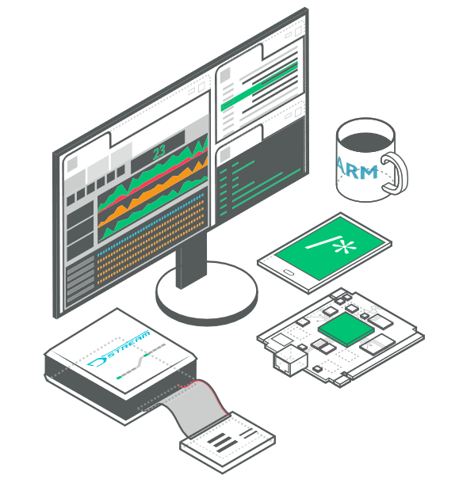
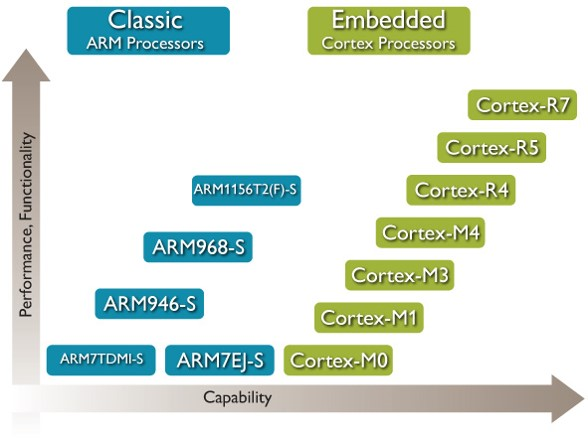
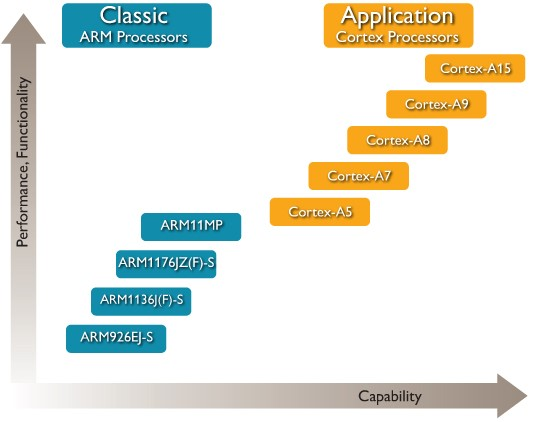

# ARM Development - ARM 开发

## ARM 的开发者文档

[http://infocenter.arm.com/help/index.jsp](http://infocenter.arm.com/help/index.jsp)

## ARM Processor 

ARM 历史版本   

嵌入式处理器   

多媒体应用处理器   

## ARM 的基本数据类型 

* ARM 采用的是32位架构.
* ARM 约定:
	* Byte ：	8 bits
	* Halfword ：  16 bits (2 byte)
	* Word :	 32 bits (4 byte)
	* Doubleword   64-bits（8byte）（Cortex-A处理器）

## ARM 架构

* 寄存器
* 指令集
* 字节顺序
* 三级流水线
* 协处理器
* 异常和中断
* 调试
* 浮点运算
* SIMD
* NEON
* Security