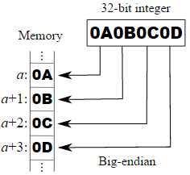
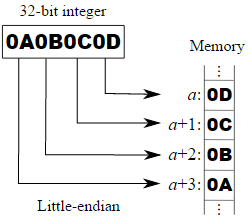

# Endianness - 字节顺序

1 byte = 8 bit.
当一个变量的长度超过 1 byte 的时候，当这个变量存放时就要考虑字节顺序了。

所有的处理器的字节顺序，就两种：little endian 和 big endian.
 network byte order(网络字节序) 永远是 big endian.

* MIPS处理器的字节序为 big endian
* x86处理器的字节序为 little endian
* ARM处理器的字节序为 little endian，通过配置寄存器，还能变成 big endian

不同字节顺序的处理器不能通行，除非转换成一致的字节顺序。
网络之所以能在不同处理器上传送信息是因为网络的字节顺序已经确定为 big endian.
需要通过网络传送的数据，必须先转换成 big endian 再传送。

|字节顺序|描述|图示|
|:---|:---|:---|
|big endian|大端模式：大的在内存前面||
|little endian|小端模式：小的在内存前面||
