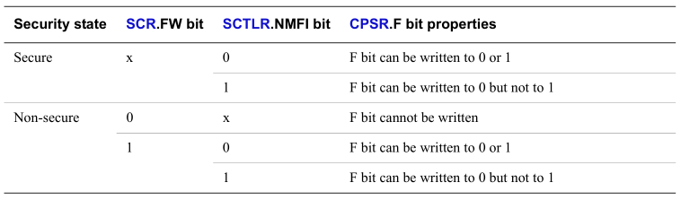

# ARMv7 Instruction Sets - ARMv7 指令集

指令是01码，一般为2个字节或4个字节长。可以用助记符记忆指令。
指令就是所谓的机器语言，助记符就是所谓的汇编代码。

ARMv7 包含了两种指令集：ARM指令集和Thumb指令集，它们中的指令大多数是相同的。
Unified Assembler Language (UAL)可以被编译成上述两种指令集中的其中一种。

* Thumb 指令既有16位的，也有32位的
	* 大部分 16 位指令只能访问ARM核心寄存器中的R0到R7,R0到R7也被称为 low register ,
	一小部分 16 位指令可以访问 high register,也就是R8到R15.
	* 用32位指令完成任务的方法比用两个或更多16位指令才能完成任务的方法更加高效。
	* 32位指令可以访问所有的ARM核心寄存器，从R0到R15.
* ARM 指令总是32位的。

ARM指令和Thumb指令可以无缝地切换工作。

## ARMv7 指令集的种类
* Data-processing Instructions - 数据处理指令
* Status register access instructions
* Load/store instructions
* Load/store multiple instructions
* Miscellaneous instructions
* Exception-generating and exception-handling instructions
* Coprocessor instructions
* Advanced SIMD and Floating-point load/store instructions
* Advanced SIMD and Floating-point register transfer instructions
* Advanced SIMD data-processing instructions
* Floating-point data-processing instructions

[ARM指令集参考](resource/ARMCard.pdf)

## Effects of the Security Extensions on the CPSR A and F bits

