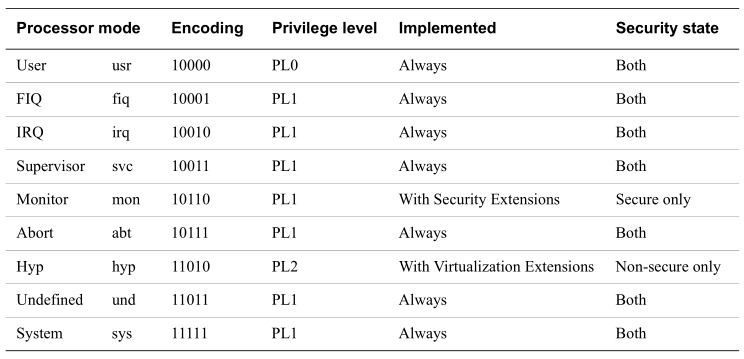
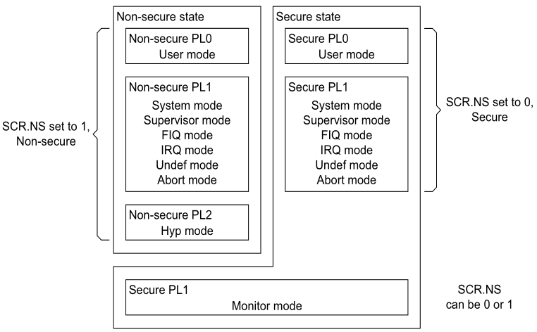

# 处理器工作模式

ARM processor modes   

## User mode 用户模式

* 操作系统在 User mode 运行应用程序是为了限制其使用系统资源
* 运行在 User mode 的软件是在 Privilege level 0,也就是 unprivilege(非特权)状态。
* 任何在 User mode 运行的程序，意味着它
	* 只能以非特权身份访问系统资源，意味着它不能访问受系统保护的资源
	* 只能以非特权身份访问内存
	* 无法改变自身的 mode ,除非异常发生了

## System mode  操作系统模式

* 运行在 System mode 的软件是在 Privilege level 1
* 和 User mode 使用一样的寄存器

## Abort mode 中止模式

* 数据中止异常
* 预存取中止异常

## Undefined mode 未定义模式

* 当运行一个未定义的 指令 时，处理器会切换到未定义模式

## FIQ(Fast Interrupt Request) mode 快速中断请求模式

* 当发生 FIQ 中断时，处理器进入此模式

## IRQ(Interrupt Request) mode (普通)中断请求模式

* 当发生 IRQ 中断时，处理器进入此模式

## Hyp mode

* Hyp 模式是  Non-secure PL2 mode
* Hyp 模式是处理器拓展功能之虚拟化技术的一部分

## Monitor mode 

* 为了执行安全监控代码而存在的模式

## Secure and Non-secure modes 安全与非安全模式

为了拓展处理器的“安全”功能，上述模式不是在安全模式下，就是在非安全模式下。

*这里有一张图，描述了模式之间的关系*   

* Monitor mode 永远在安全模式，即使SCR.NS==1也没法切换到非安全模式
* Hyp mode 永远在非安全模式