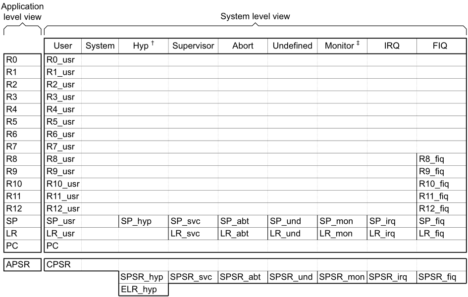
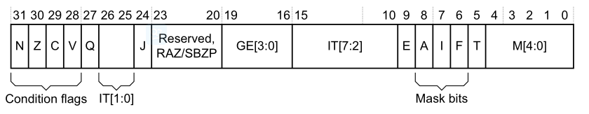

# Register - Cortex-A9 使用的寄存器

## ARM 寄存器组

## CPSR & SPSR

* CPSR - Current Program Status Register
* SPSR - Saved Program Status Register

Condition flags, 条件标志：
* N = Negative result from ALU 
* Z = Zero result from ALU
* C = ALU operation Carried out or  borrow
* V = ALU operation oVerflowed

Q, bits[31:28]：
* 仅ARM  v5TE-J架构支持
* 指示饱和状态

J, bit[24]:
* 仅ARM  v5TE-J架构支持
* T=0;J = 1  处理器处于Jazelle状态
* 也可以和其他位组合
* DNM位：Do Not  Modify

GE[3:0], bits[19:16]: 大于或等于(当执行SIMD指令时有效)

IT[7:0], bits[15:10, 26:25]    IF….THEN….指令执行状态位

E, bit[9]：大小端控制位
* 0 Little-endian operation
* 1 Big-endian operation

Mask bits, bits[8:6]
* A, bit[8] Asynchronous abort mask bit.A=1 禁止不精确的数据异常
* I, bit[7] IRQ mask bit 中断禁止位
* F, bit[6] FIQ mask bit.快速中断禁止位

T, bit[5]
* T = 0;J=0; 处理器处于 ARM 状态
* T = 1;J=0 处理器处于 Thumb 状态
* T = 1;J=1 处理器处于 ThumbEE 状态

Mode位：处理器模式位
* 10000  User mode;
* 10001 FIQ mode;
* 10011 SVC mode;
* 10111  Abort mode;
* 11011 Undfined mode;
* 11111 System mode;  
* 10110  Monitor mode;
* 10010 IRQ
