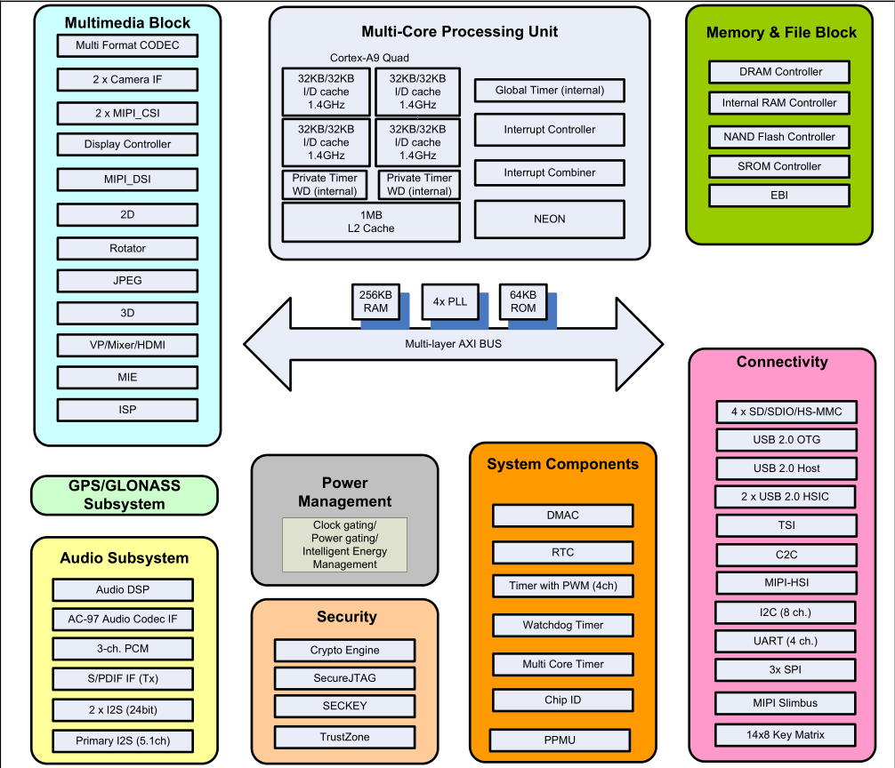

# AXI Bus - AXI 总线

## 技术介绍

AXI（Advanced eXtensible Interface）是一种总线协议，该协议是ARM公司提出的
AMBA（Advanced Microcontroller Bus Architecture）3.0协议中最重要的部分，
是一种面向高性能、高带宽、低延迟的片内总线。它的地址/控制和数据相位是分离的，
支持不对齐的数据传输，同时在突发传输中，只需要首地址，同时分离的读写数据通道、
并支持Outstanding传输访问和乱序访问，并更加容易进行时序收敛。AXI 是AMBA 中一个新的高性能协议。
AXI 技术丰富了现有的AMBA 标准内容，满足超高性能和复杂的片上系统（SoC）设计的需求。

## 技术应用举例

