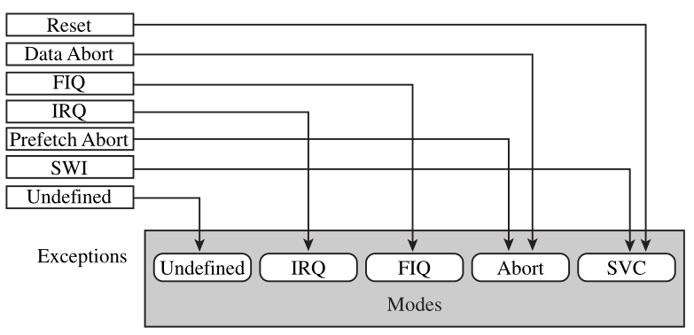

# Expection - 异常

异常是嵌入式重要核心之一。

## 异常的种类
* Reset : Exynos 4412 芯片重启或者初次上电时触发此异常
* Abort : 取不到数据或者预取指令时触发此异常
* Undefined : 取到未知指令时触发此异常
* FIQ : 快速中断
* IRQ : 普通中断
* SWI : 软件中断

## 异常与模式

## 注意

* 中断是异常的一种
* 芯片上电总会触发 reset 异常
* 异常发生时，ARM处理器总是切换到ARM状态，而不是Thumb状态

