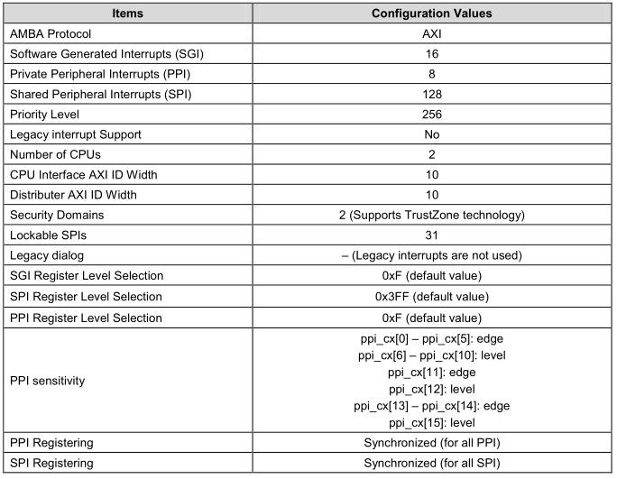
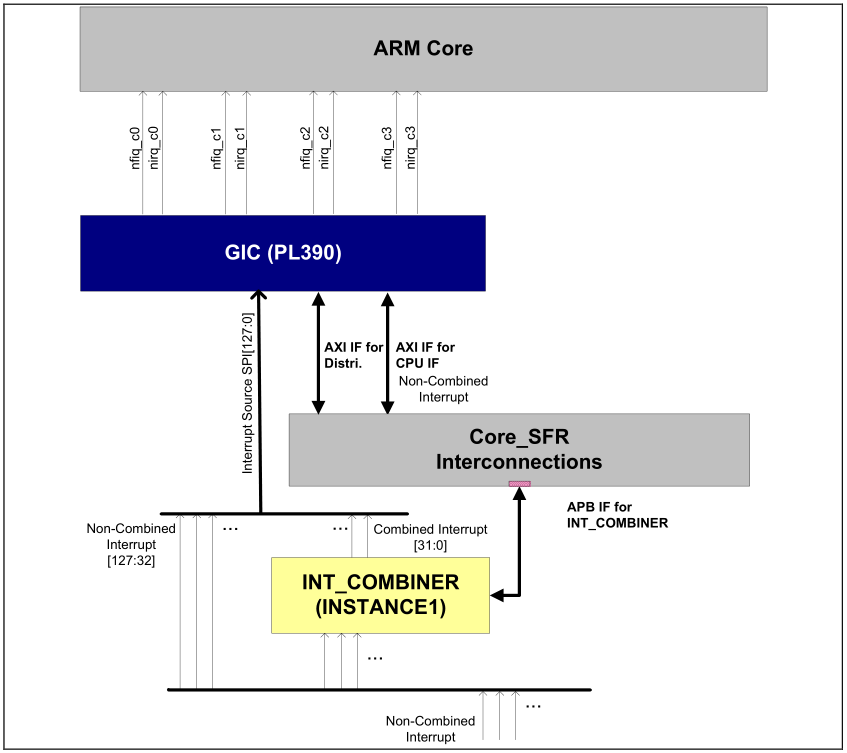
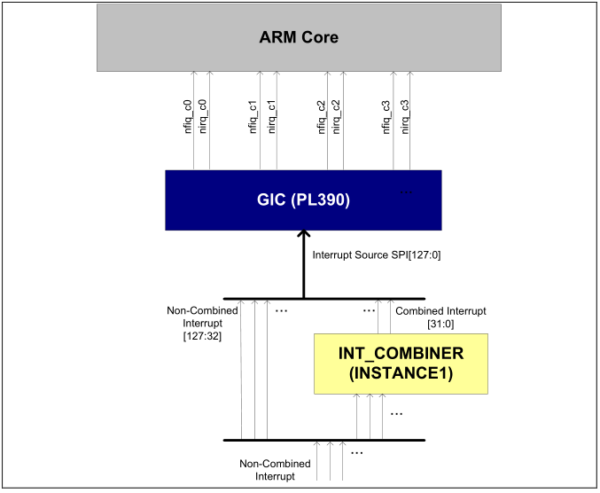
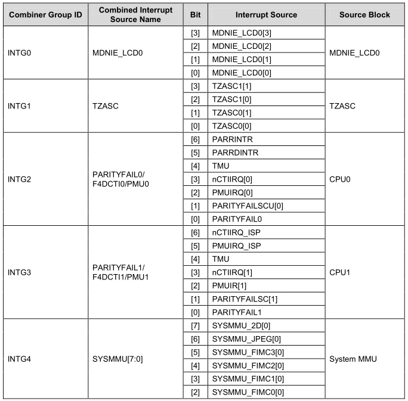

# Interrupt - 中断

## Exynos 4412 中断控制器

GIC（Generic Interrupt Controller）是ARM公司提供的一个通用的中断控制器，具体GIC硬件的实现形态有两种，
一种是在ARM vensor研发自己的SOC的时候，会向ARM公司购买GIC的IP，这些IP包括的型号有：PL390，GIC-400，GIC-500。
其中GIC-500最多支持128个 cpu core，它要求ARM core必须是ARMV8指令集的（例如Cortex-A57），
符合GIC architecture specification version 3。另外一种形态是ARM vensor直接购买ARM公司的Cortex A9或者A15的IP，
Cortex A9或者A15中会包括了GIC的实现，当然，这些实现也是符合GIC V2的规格。

GIC 支持如下：
* ARM架构安全扩展
* 从外设中断源启用、禁用、生成处理器中断
* 产生软中断
* 中断屏蔽
* 中断优先级

GIC特性:
* 支持三种类型的中断
	1. Software Generated Interrupt (SGI) : 软中断
	2. Private Peripheral Interrupt (PPI) : 只能被某个处理器私有处理的中断
	3. Shared Peripheral Interrupt (SPI) : 多个处理器核都能处理的中断
* 可以通过编程来设置中断
	* 设置某中断的安全状态
	* 设置某中断的优先级
	* 启用或禁用某中断
	* 让处理器接收某中断

## Exynos 4412 中断控制器配置表

## 中断的几种状态

* Inactive : 既不是 Active 也不是 Pending
* Pending : 中断GIC 已经准备好交给处理器去处理了
* Active : 中断正在被处理器处理
* Active and Pending : 中断正在被处理器处理，又来了个同源的中断在门外等待

## 中断触发的方式

* Edge-triggered : 硬件上的引脚信号边沿触发方式
	* 上升沿触发
	* 下降沿触发
	* 双边沿触发(上升沿或者下降沿)
* Level-sensitive : 硬件上的引脚电平触发方式
	* 高电平触发
	* 低电平触发

## 软中断

* 作用 : 软中断是多核间通讯的机制
* 实现 : 向 GIC 中的某些特殊寄存器写数据
* 触发 : 边沿触发
* 路由模式 :
	* 1-N 模式 : GIC 只向一个处理器核传递中断
	* N-N 模式 : GIC 向多个处理器核传递中断

## 中断源

## 中断 ID

参考《Exynos 4412 用户手册》 之 "9.2.2 GIC Interrupt Table" , 745页。

Exynos 4412 一共有160个中断，其中:
* Software Generated Interrupts (SGIs[15:0], ID[15:0])
* Private Peripheral Interrupts(PPIs[15:0], ID[31:16])
* Shared Peripheral Interrupts (SPIs[127:0], ID[159:32])

## 中断合路器

* 116 interrupt source inputs.
* 18 group interrupt outputs.
* Enables or masks each interrupt source in a group.
* Provides the status of interrupt source in a group before interrupt masking.
* Provides the status of interrupt source in a group after interrupt masking.
* Provides the status of group interrupt output after interrupt masking and combining

参考《Exynos 4412 用户手册》 之 "10.2.1 Interrupt Combiner" , 827页。
