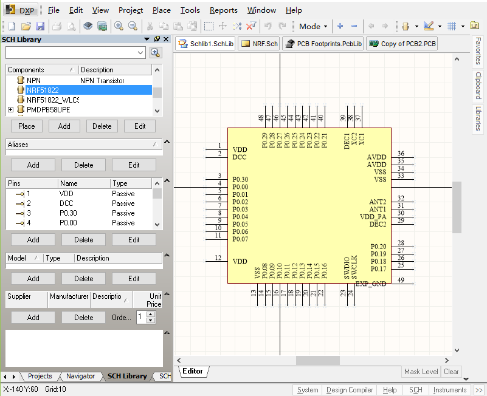
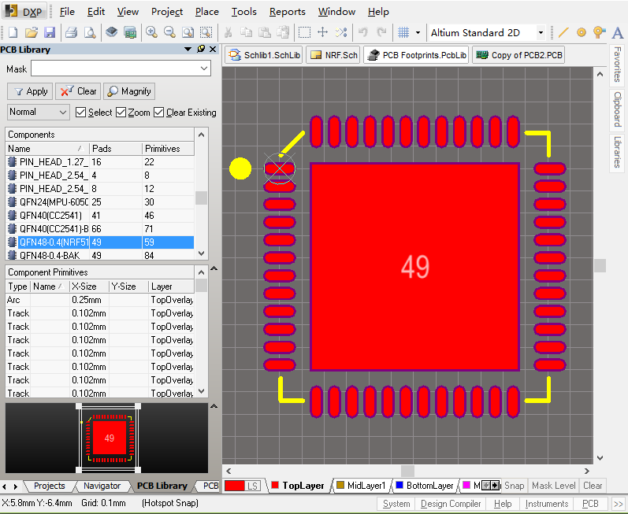
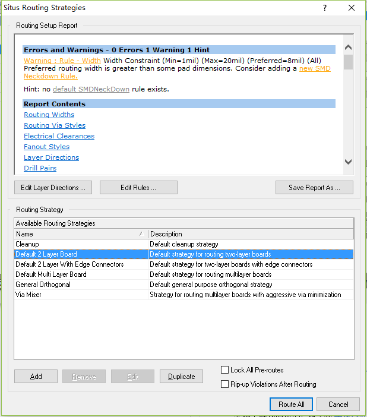
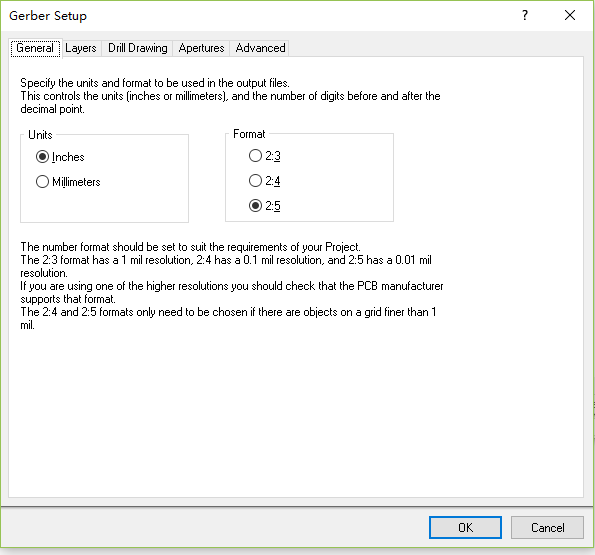
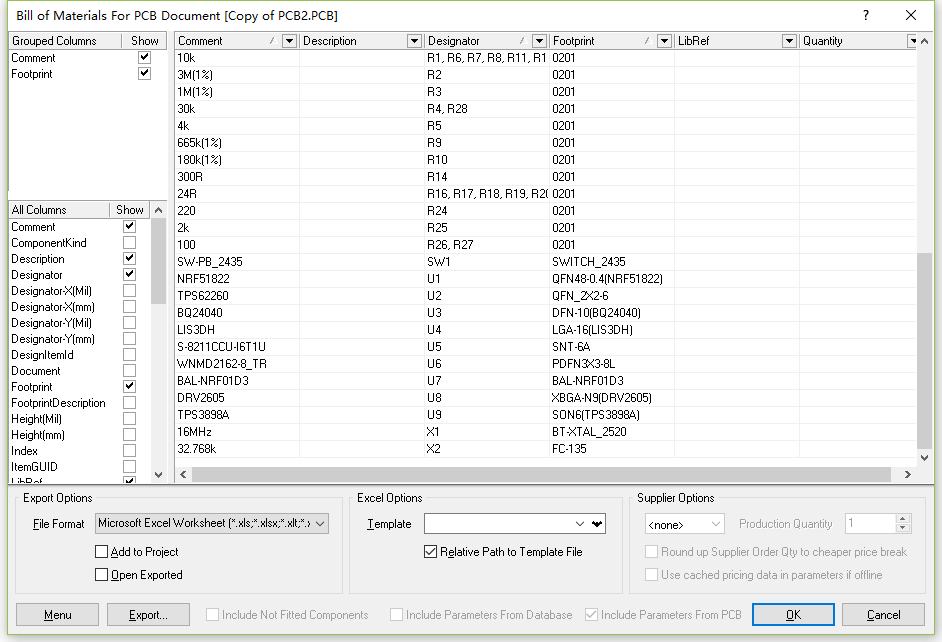
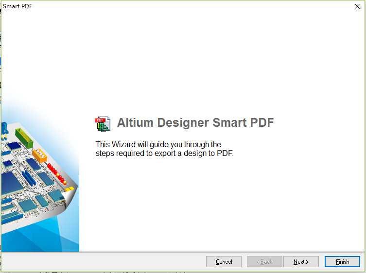

# Altium Designer

Altium Designer , 前身叫做 DXP 。是一款简单易学的电路原理图绘制和
PCB布线的软件，流行于广大的高校之中。

## Project 项目

创建项目：
> File -> New -> Project -> PCB Project

## Schematic Designer 原理图绘制

### Schematic Libray 原理图库
> File -> New -> Libray -> Schematic Libray

### Schematic 原理图
> File -> New -> Schematic

## PCB Layout 印制电路板布线

### PCB Libray 印制电路板库
> File -> New -> Libray -> PCB Libray

PCB Libray 中包含着 Electronic components(电子元器件) 的 footprint 信息，而 footprint 要根据
电子元器件的封装信息来绘制。

### PCB Layout 印制电路板布线
> AutoRoute -> All

## 后期工作

### Gerber 制作电路板

将 印制电路板 .pcb 文件导出为 gerber 文件，然后交给PCB厂家制作。

在打开 .pcb 文件的情况下，
> File -> Fabrication -> Gerber

### 导出元器件

导出元器件，交给采购，购买元器件

> Reports -> Bill of Materials

### 导出原理图

导出原理图为PDF格式，交给软件工程师，方便其了解电路连线，开发软件。

在打开原理图的情况下：

> File -> Smart PDF

## PCB制作

加工PCB板的方法有三：

1. 自己手动制作
	e.g. [感光腐蚀PCB制作](http://wenku.baidu.com/link?url=SWXu_I03bDSCmdC6J6Laa6Cd7M9a4PydwreYr-YTaH57MUqD4Gqt6xy7WHZ8tGBTcpfhuYRonAXoZVzkFGSeTGIjd2NW1DpkKrw6BmS11Oe)

2. 电子城寻找制板店铺

3. 网上寻找制板的厂家
	e.g. [华强PCB](http://www.hqpcb.com/)