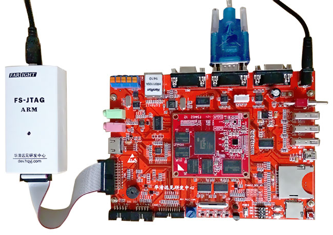

# FS4412 - 华清远见A9开发板

FS4412开发板的核心芯片是 三星半导体公司 Exynos 4412.

## FS4412 开发板的配置

FS4412采用的处理器使用Samsung最新的ARM Cortex-A9四核CPU的Exynos4412, 
主频达到1.4~1.6GHz。该芯片采用了最新的32nm的先进工艺制程，功耗方面有了明显的降低。

|模块|参数|
|:---|:---|
|CPU|Exynos 4412|
|主频|1.5Ghz|
|运行内存|2GB|
|存储内存|4GB eMMC闪存|
|A/D|电位计(可调电阻)|
|PWM|无源蜂鸣器|
|GPIO|4个LED灯|
|I2C|加速度/陀螺仪传感器|
|SPI|SPI接口的CAN线芯片|
|UART|3个|
|单总线|温度传感器/红外接收器|
|I2S|音频接口芯片|
|USB|3路USB HOST、1路USB OTG|
|CAN|1路CAN总线扩展|
|SDIO|1路SD卡/TF卡接口|
|CSI|1路摄像头接口|
|LCD|一个RGB/LVDS接口，配置1024*600的液晶屏|
|异步系统扩展总线|100M网卡芯片|
|HDMI|支持1080P输出|

## FS4412 开发板的计算机结构

|计算机结构|器件类型|器件型号|
|:---|:---|:---|
|运算器+控制器|CPU|Exynos 4412|
|存储器|memory|K4B4G1646B|
|存储器|闪存 eMMc|KLM4G1YE4C-B001|
|存储器|闪存 SD|MS110-C10B-C16|
|输入设备|按键|按键|
|输入设备|UART|RS-232|
|输出设备|UART|RS-232|
|输出设备|LED|贴片式0604 LED灯|

## FS4412 开发板的电路原理图

[核心图](resource/schematic/FS4412_CoreBoard_V2.pdf)

[底层板](resource/schematic/FS4412-DevBoard-V5.pdf)

## FS4412 开发板芯片手册

[芯片手册打包下载](resource/datasheet.zip)

单独下载
* [Exynos4412 Users Manual](resource/datasheet/SEC_Exynos4412_Users_Manual_Ver.1.00.00.pdf)   
* [Exynos4412 iROM Secure Booting Guide](resource/datasheet/Exynos4412_iROM_Secure_Booting_Guide_Ver.1.00.00.pdf)   
* [5点电容屏控制芯片GT818](resource/5点电容屏控制芯片GT818.pdf)   
* [16位双向三态锁存器](resource/datasheet/74ALVC164245.pdf)   
* [三周加速度传感器](resource/datasheet/BMA250-DS002-02.pdf)   
* [eMMC闪存](resource/datasheet/KLMxGxxE4x.pdf)   
* [以太网 LAN9215](resource/datasheet/LAN9215.pdf)   
* [UART-RS232](resource/datasheet/MAX3232CSE.pdf)   
* [CAN控制器](resource/datasheet/mcp2515.pdf)   
* [位移传感器](resource/datasheet/MPU3050.pdf)   
* [开关电源转换](resource/datasheet/sgm6600.pdf)   
* [LCD控制器](resource/datasheet/sn75lvds83b.pdf)   
* [蓝牙WIFI二合一控制器](resource/datasheet/SWB-A31_DS_Data.pdf)   
* [双向电平转换](resource/datasheet/TXS0102.pdf)   
* [USB控制器](resource/datasheet/USB3503A.pdf)   
* [立体声解码器](resource/datasheet/WM8960__Natertech.pdf)   