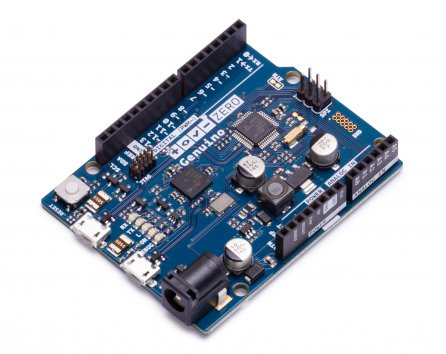

# Note - 硬件开发笔记

## 推荐开发板
	
### Raspberry-pi

[http://www.raspberrypi.org](http://www.raspberrypi.org)   
[http://cn.element14.com/buy-raspberry-pi?ICID=I-HP-PP-raspberrypi-04](http://cn.element14.com/buy-raspberry-pi?ICID=I-HP-PP-raspberrypi-04)   

* 1.2GHz 64-bit quad-core ARMv8 CPU
* 802.11n Wireless LAN
* Bluetooth 4.1
* Bluetooth Low Energy (BLE)
* 1GB RAM
* 4 USB ports
* 40 GPIO pins
* Full HDMI port
* Ethernet port
* Combined 3.5mm audio jack and composite video
* Camera interface (CSI)
* Display interface (DSI)
* Micro SD card slot (now push-pull rather than push-push)
* VideoCore IV 3D graphics core

### Arduino 
[http://www.arduino.cc](http://www.arduino.cc)   
[http://www.waveshare.net/aspx/search.aspx?keywords=tag-Arduino](http://www.waveshare.net/aspx/search.aspx?keywords=tag-Arduino)   

|name|parameter|
|:---|:---|
|Microcontroller|ATSAMD21G18, 32-Bit ARM Cortex M0+|
|Operating Voltage|3.3V|
|Input Voltage (recommended)|from 7 to 12 Volts|
|Digital I/O Pins|20|
|PWM Digital I/O Pins|All but pins 2 and 7|
|Analog Input|Pins 6, 12-bit ADC channels|
|Analog Output|Pins	1, 10-bit DAC|
|DC Current per I/O Pin|7 mA|
|Flash Memory|256 KB|
|SRAM|32 KB|
|Clock Speed|48 MHz|
|Height|55 mm|
|Weight|30 gr.|
|Length|80 mm|

### 支持mebed物联网操作系统的开发板
https://www.mbed.com/zh-cn/development/hardware/boards/   
	
## 开发板选型和采购

* 爱板网 [http://www.eeboard.com](http://www.eeboard.com)
* 微雪电子 [http://www.waveshare.net/](http://www.waveshare.net/)		
* SeeedStudio [https://www.seeedstudio.com/](https://www.seeedstudio.com/)

## 开源项目分享网站
* hackaday [http://hackaday.com/](http://hackaday.com/)
* instructables [http://www.instructables.com/](http://www.instructables.com/)

## 常见问题

Q:芯片选型要注意什么？  
A:
* 功耗：带电池的设备特别注重功耗，比如穿戴式设备，每天充电的设备用户体验不好
* 封装：封装越小，越有可能做成超薄超小的设备
* 散热：有的芯片，比如MOS，做电源转换的，发热量巨大就要搭载风扇，有风扇就会造成设备体积增大，重量加重
* 耐受度：主要看它正常工作的温度范围，有的芯片对震动有要求，震动太大就会失灵 

Q:在哪儿去寻找芯片手册？   
A:
* 淘宝宝贝描述
* 专业芯片采购商的芯片详情
* 书店，报刊亭里电子相关的杂志，比如《无线电》，《电子报》
* 学校图书馆、城市图书馆内关于电子相关的报刊杂志

Q:芯片手册(datasheet)里有哪些信息值得注意     
A:
* 对于硬件工程师来说：引脚作用、电气特性、封装图
* 对于软件工程师来说：引脚作用、功能描述、寄存器、时序图
	
Q:通用芯片寻找网站   
A:
* http://www.datasheetdir.com/
* http://www.alldatasheet.com/
* http://www.datasheet5.com
	
Q:电子工程师网址推荐  
A:
* 电子信息港 http://www.eehub.cn
* 与非网 http://www.eefocus.com
* 电子电路 http://www.cndzz.com
* 21ic中国电子网 http://www.21ic.com/
* ourplc http://www.ourplc.com
* 阿莫电子 http://www.amobbs.com/index.php
	
Q:硬件工程师开发技巧  
A:
* 画封装时，可以去Ad官网下载schematic library 和 pcb library , 不用自己画
* 采购时，可以把元器件清单交给淘宝卖家或电子城的老板，让别人配好送到公司
* 如果不知道原理图怎么画，
	* 可以去电子电路网(cndzz.com)或者21ic网去看别人的设计；
	* 或者去半导体公司，比如ti的官网搜索application note,ti提供了好多关于芯片的应用
	* 或者翻墙去google国外的设计图；
	* 或者将竞争对手的产品买回来进行拆解分析
	* 或者去图书馆看有没有电路图相关的书籍