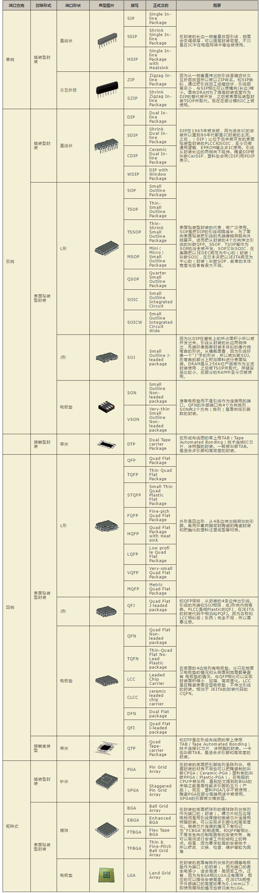
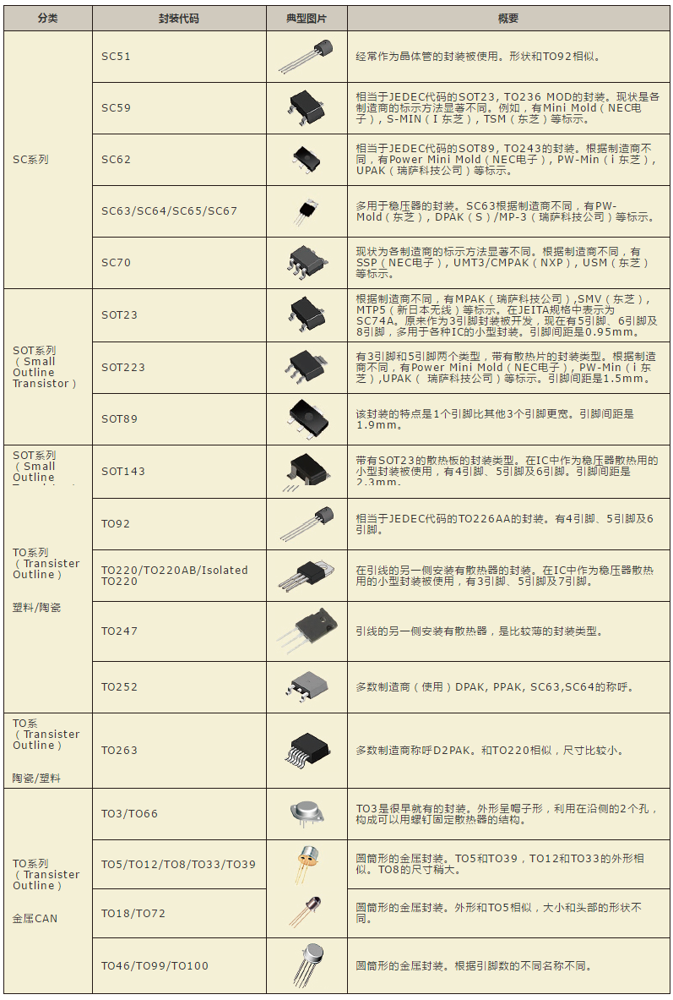

# Packgae - 电子元器件的封装

## 电子元器件封装按照焊接时是否穿孔来分有两大类：
1. through-hole 直插式
2. Surface-mount 贴片式

直插式元器件逐渐被贴片式元器件取代了。
因为贴片式元器件具有更小的封装，更低的功耗，更便宜的价格。
并且贴片式元器件可以用机器批量地焊接在电路板上。
大大地加快了印制电路板生产加工的速度。

## 电子元器件封装按照集成芯片和分立器件来分有两大类：

**IC-Packgae 集成芯片**   

**Discrete-Packgae 分立器件**   

## 注意

同一个型号可能有多种封装形式，制作PCB时，选择使用哪种封装形式，要看产品需求。

不知道芯片有哪些封装？去[蓝海恒星](https://2010ic.taobao.com/)看看。