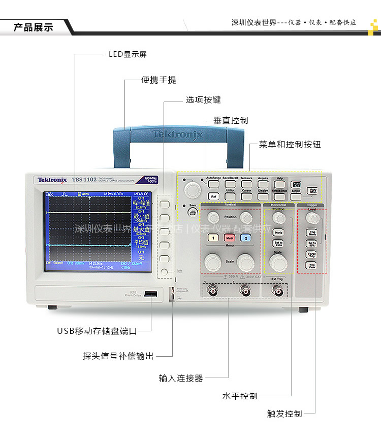
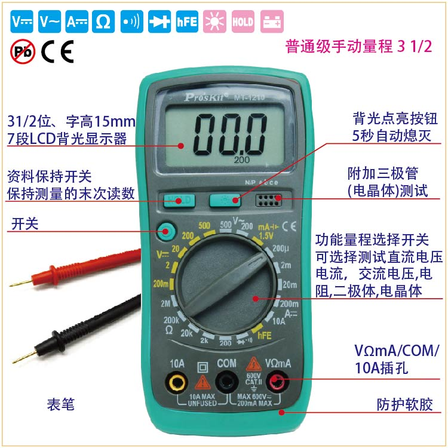
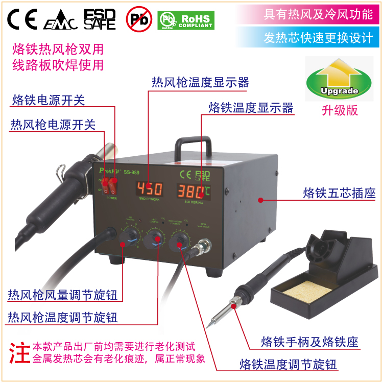
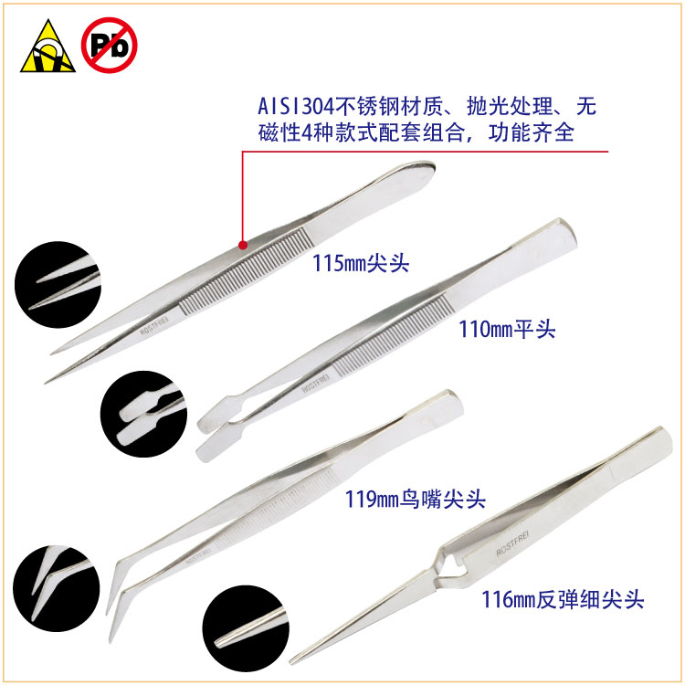
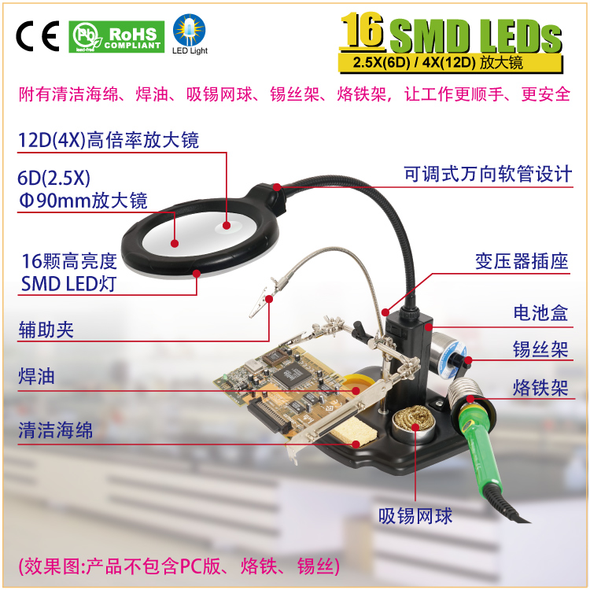
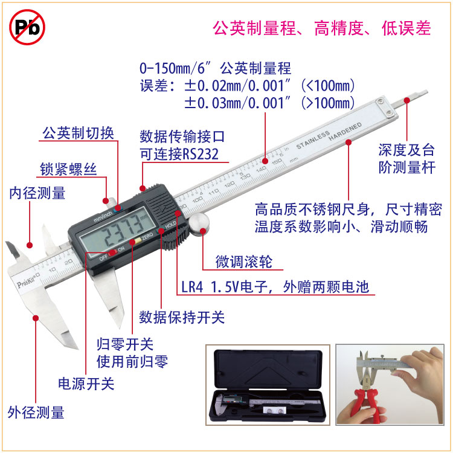
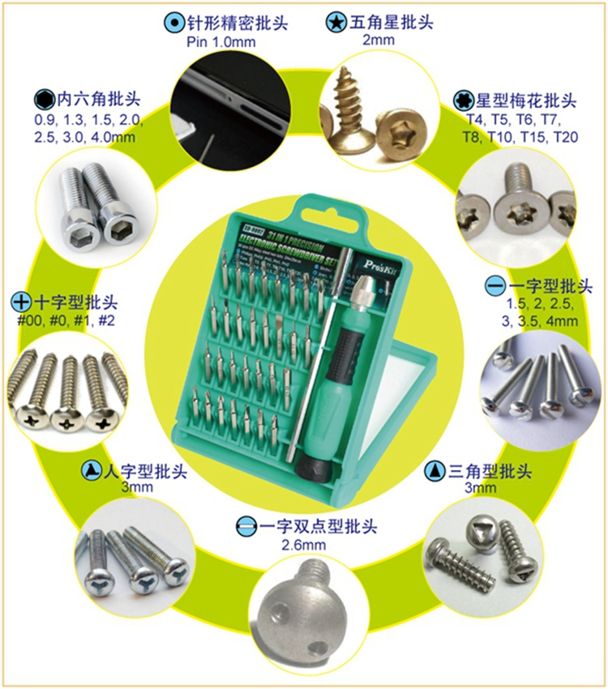
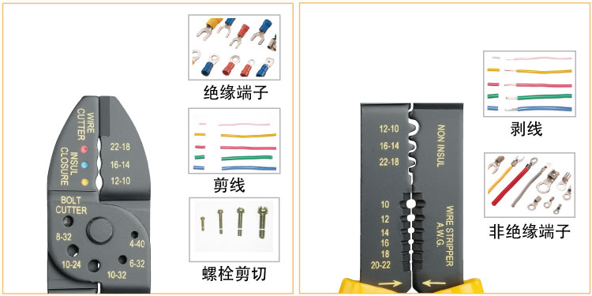
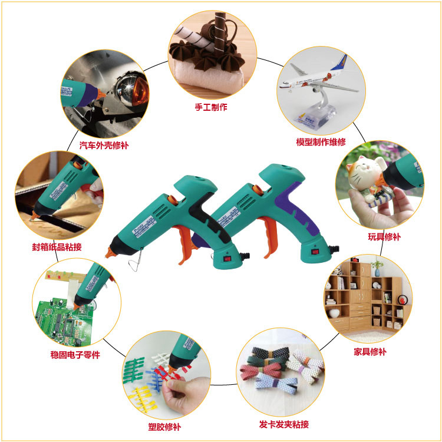

# Tool - 电子开发所用工具

## 示波器

示波器用于探测电路是否按照预期工作

## 万用表

万用表用于测量电路通断，测试基本元器件的好坏。

## 电烙铁+热吹风枪

电烙铁用于将 电子元器件 焊接到 电路板 上。
热吹风正好相反，它将 电子元器件 从 电路板 上解焊。

## 镊子

镊子用于夹持 微小的电子元器件 到 电路板 上，便于焊接。
或者解焊时，将被热吹风枪吹得摇摇欲坠的电子元器件取下来。

## 放大镜

放大镜作为焊接的协助工具，用来将微小的元器件看清楚。

## 游标卡尺

游标卡尺用于测量 元器件的尺寸 ，这在对电路板进行反向工程的时候有用。

## 起子组合

起子用于拧螺丝。

## 剥线钳

剥线钳用于剥线。

## 热熔枪

热熔枪用于将小块的电路板牢固地粘在产品的外壳上。

