# Computer architecture - 计算机机构

现代计算机机构：
* 输入设备
* 输出设备
* 存储器
* 运算器
* 控制器
* 总线

计算机发展到现代，经历了从简单到复杂的过程。

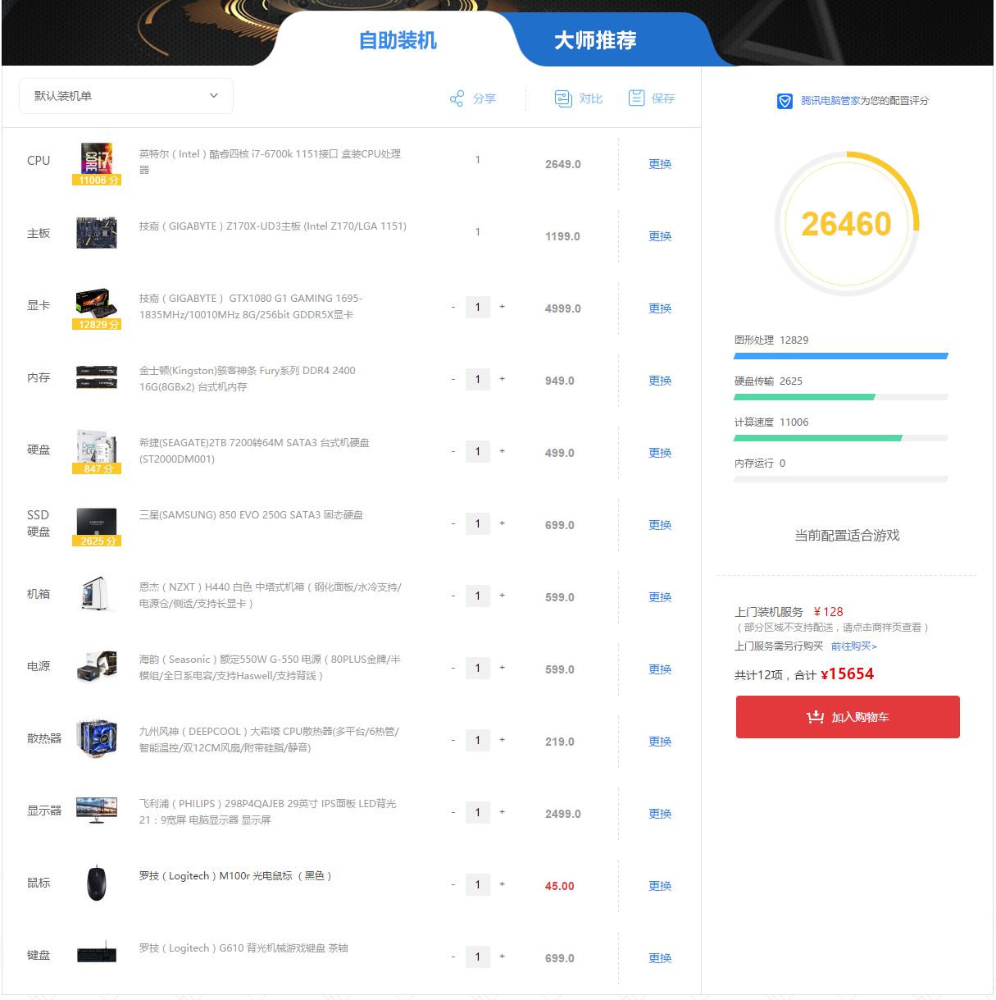

## 输入设备

输入设备的任务是把人们编好的程序和原始数据送到计算机中去，并且将它们转换成计算机内部所能识别和接受的信息方式。
常用的有键盘、鼠标、扫描仪、数位板等。

蓝牙键鼠套装   

扫描仪   
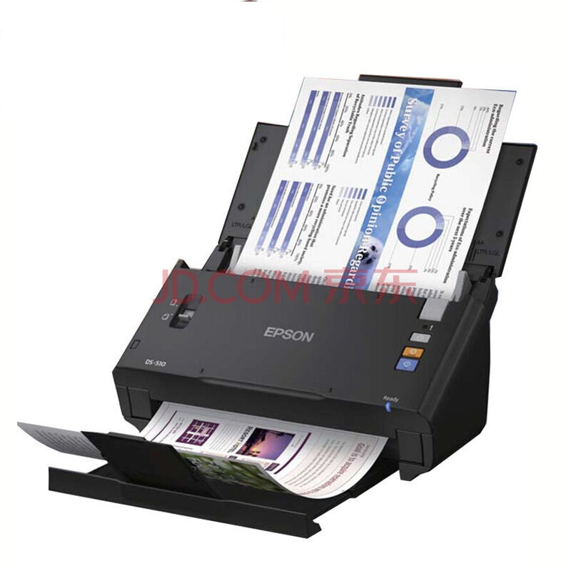

数位板   
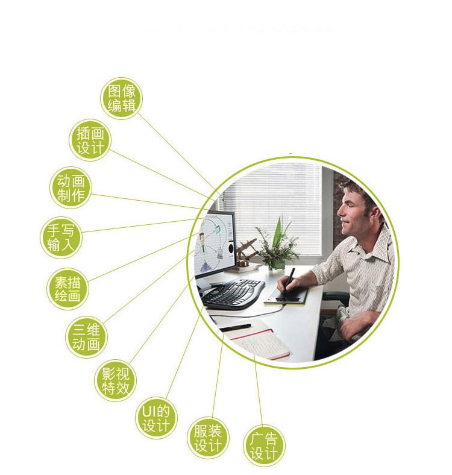

## 输出设备

输出设备的任务是将计算机的处理结果以人或其他设备所能接受的形式送出计算机。常用的有显示器、投影仪、打印机、音响等。

显示器   
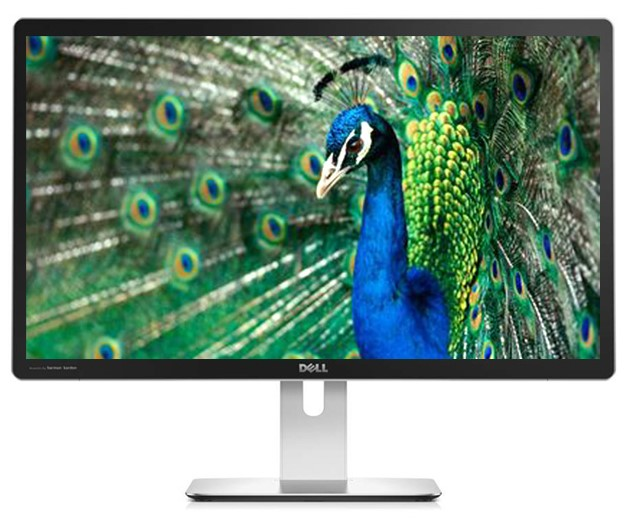

投影仪   
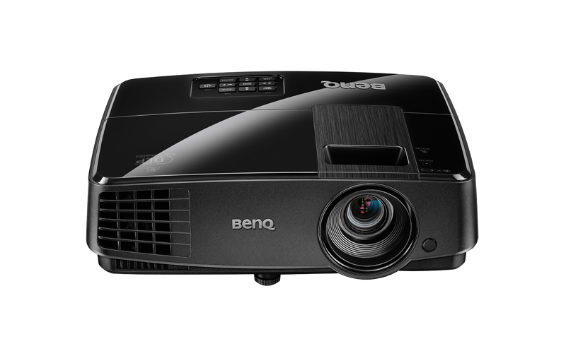

打印机   
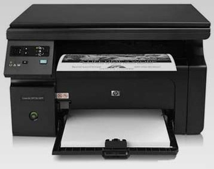

音响   
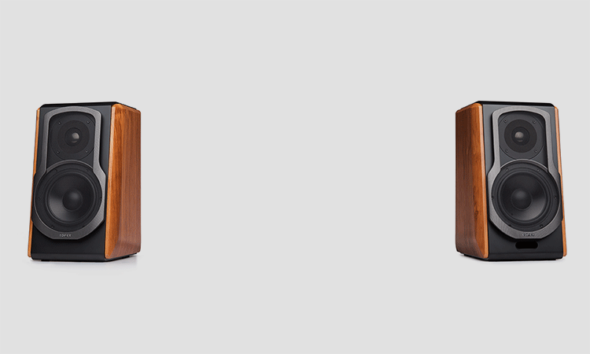

## 存储器

存储器是用来存放程序和数据的部件，它是一个记忆装置，也是计算机能够实现“存储程序控制”的基础。

|位置|名称|速度|价格|作用|
|:---|:---|:---|:---|:---|
|CPU内|register 寄存器|3.3GHz|8k/2000元|临时存放CPU指令|
|CPU内|cache 缓存|3.3GHz,|3M/2000元|运行进程中被频繁调用的部分|
|主板上|memory 内存|2.4Mhz|8Gb/300元|运行进程|
|机箱内|disk 硬盘|24Khz|1T/300元|存放程序和数据|
|机箱外|tap 磁带机|5Khz|2.5T/300元|备份硬盘数据|

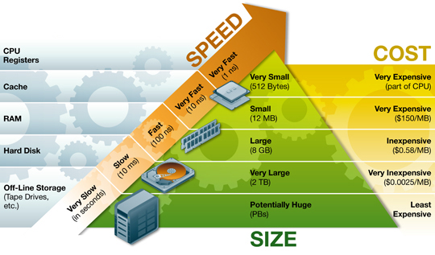

## 运算器

运算器是对信息进行处理和运算的部件，经常进行的运算是算术运算和逻辑运算，因此运算器的核心是算术逻辑运算部件ALU。
运算器中有若干个寄存器（如累加寄存器、暂存器等）。

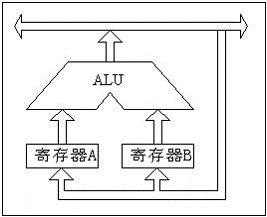

## 控制器

控制器是整个计算机的指挥中心。控制器中主要包括时序控制信号形成部件和一些专用的寄存器。CPU = 运算器 + 控制器.

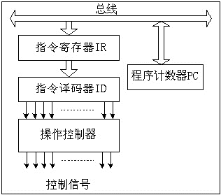

## 总线

总线是一组能为多个部件服务的公共信息传送线路，它能分时地发送与接收各部件的信息。
目前许多计算机（主要指小、微型计算机）的各大基本部件之间是用 Bus (总线)连接起来的。
          
单总线结构：

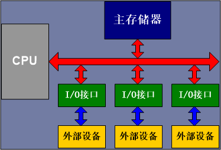

多总线结构：

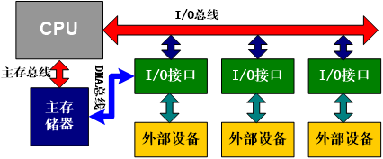

例如，ARM 中有两种总线
* AHB(Advanced High performance Bus) : AHB主要用于高性能模块，比如CPU，内存之间的连接。
* APB(Advanced Peripheral Bus) : APB主要用于低带宽的周边外设之间的连接，例如UART等。