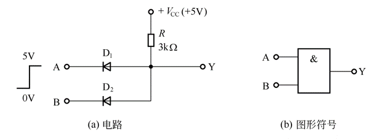
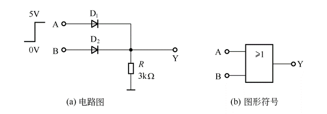
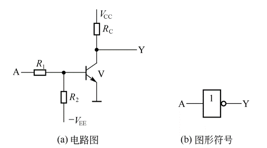
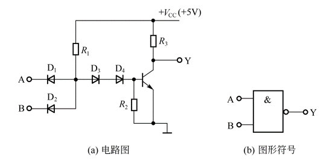
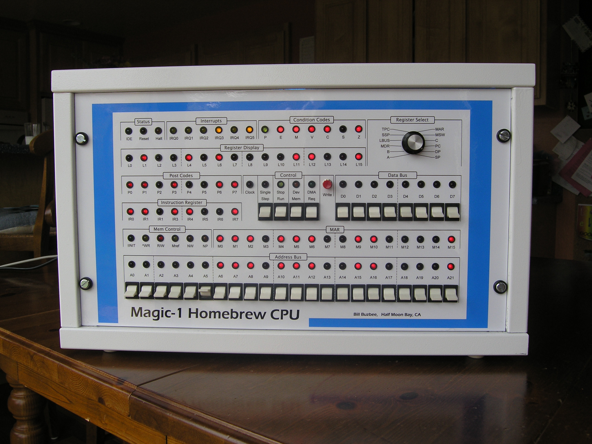
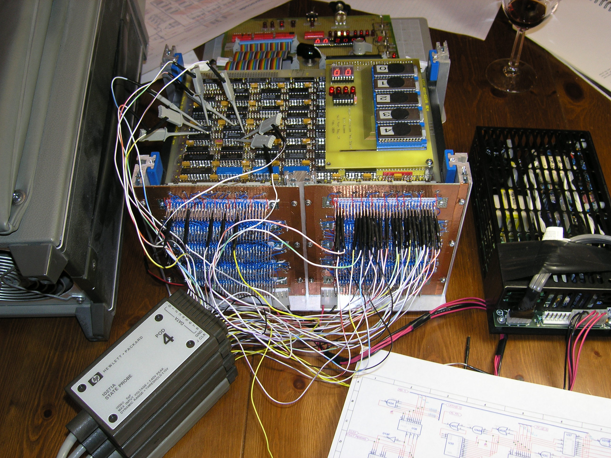
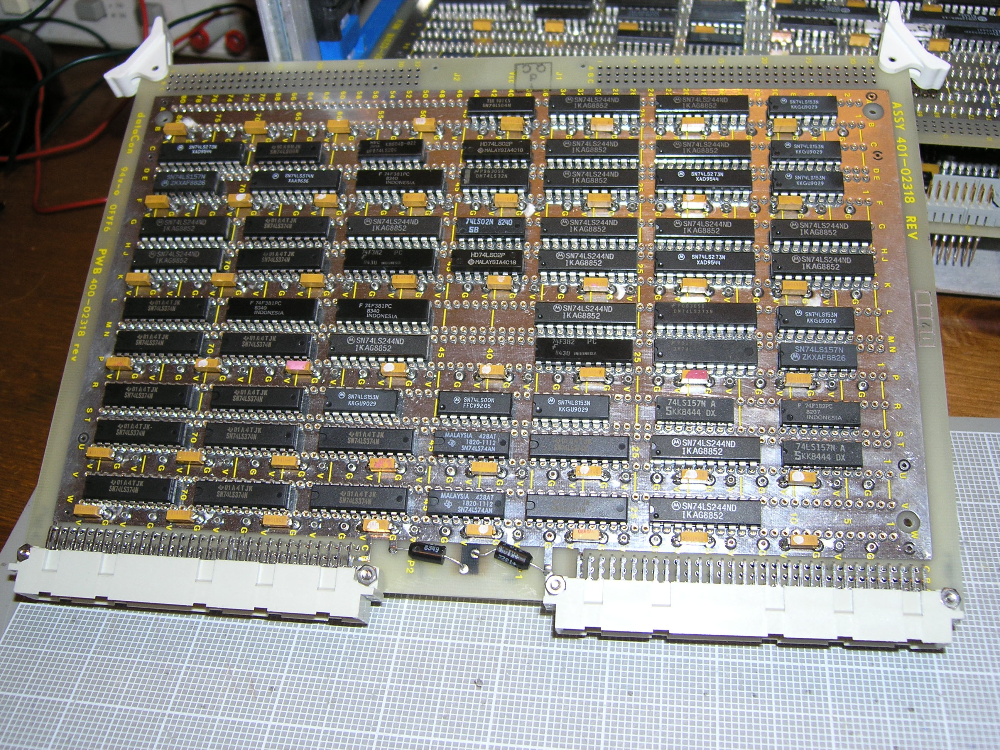
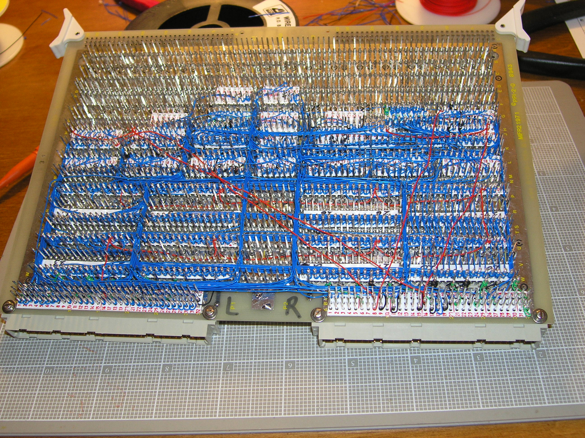

# Digital Electronic Concept - 数字电子的概念

## Signal - 信号

数字电子世界里有两种类型的信号：高电平，低电平。(e.g. high level = 5v , low level = 0v)

这两种信号对应着的数学含义是1，0.

## Gate - 门

门是数字电子种一个抽象的概念，表示表示数字信号转换的逻辑单元。

### AND Gate - 与门

与门的规则：

| input A | intput B | output Y |
| :------ | :------- | :------- |
|    0    |    0     |     0    |
|    1    |    0     |     0    |
|    0    |    1     |     0    |
|    1    |    1     |     1    |

与门的电路+与门的示意图.

### OR Gate - 或门

或门的规则：

| input A | intput B | output Y |
| :------ | :------- | :------- |
|    0    |    0     |     0    |
|    1    |    0     |     1    |
|    0    |    1     |     1    |
|    1    |    1     |     1    |

或门的电路+或门的示意图.

### NOT Gate - 非门

非门的规则：

| input A | output Y |
| :------ | :------- |
|    0    |     1    |
|    1    |     0    |

非门的电路+非门的示意图.

### NOR Gate - 或非门

或非门的规则：

| input A | intput B | output Y |
| :------ | :------- | :------- |
|    0    |    0     |     1    |
|    1    |    0     |     0    |
|    0    |    1     |     0    |
|    1    |    1     |     0    |

或非门的电路+或非门的示意图.

### NAND Gate - 与非门

与非门的规则：

| input A | intput B | output Y |
| :------ | :------- | :------- |
|    0    |    0     |     1    |
|    1    |    0     |     1    |
|    0    |    1     |     1    |
|    1    |    1     |     0    |

### EOR Gate - 异或门

异或门的规则：

| input A | intput B | output Y |
| :------ | :------- | :------- |
|    0    |    0     |     0    |
|    1    |    0     |     1    |
|    0    |    1     |     1    |
|    1    |    1     |     0    |

相同为0，不同为1

## TTL - Transistor–transistor logic 晶体管逻辑

TTL电路是Gate的具体实现之一，CMOS电路是TTL电路的继任者。

TTL电路具有结构简单，速度慢，耗电高的特点，现已被CMOS电路取代。

典型的TTL电路芯片有TI公司曾经推出的[7400 series](https://en.wikipedia.org/wiki/7400_series)

7400系列芯片同时也被其它半导体公司生产，不过现在基本上都已停产了。

[National Semiconductor 国家半导体的7400系列芯片手册下载](resource/7400series.zip)

74系列集成电路名称与功能
* 7400 TTL四2输入端四与非门
* 7401 TTL 集电极开路2输入端四与非门
* 7402 TTL 2输入端四或非门
* 7403 TTL 集电极开路2输入端四与非门
* 7404 TTL 六反相器
* 7405 TTL 集电极开路六反相器
* 7406 TTL 集电极开路六反相高压驱动器
* 7407 TTL 集电极开路六正相高压缓冲驱动器
* 7408 TTL 2输入端四与门
* 7409 TTL 集电极开路2输入端四与门
* 7410 TTL 3输入端3与非门
* 74107 TTL 带清除主从双J-K触发器
* 74109 TTL 带预置清除正触发双J-K触发器
* 7411 TTL 3输入端3与门
* 74112 TTL 带预置清除负触发双J-K触发器
* 7412 TTL 开路输出3输入端三与非门
* 74121 TTL 单稳态多谐振荡器
* 74122 TTL 可再触发单稳态多谐振荡器
* 74123 TTL 双可再触发单稳态多谐振荡器
* 74125 TTL 三态输出高有效四总线缓冲门
* 74126 TTL 三态输出低有效四总线缓冲门
* 7413 TTL 4输入端双与非施密特触发器
* 74132 TTL 2输入端四与非施密特触发器
* 74133 TTL 13输入端与非门
* 74136 TTL 四异或门
* 74138 TTL 3-8线译码器/复工器
* 74139 TTL 双2-4线译码器/复工器
* 7414 TTL 六反相施密特触发器
* 74145 TTL BCD—十进制译码/驱动器
* 7415 TTL 开路输出3输入端三与门
* 74150 TTL 16选1数据选择/多路开关
* 74151 TTL 8选1数据选择器
* 74153 TTL 双4选1数据选择器
* 74154 TTL 4线—16线译码器
* 74155 TTL 图腾柱输出译码器/分配器
* 74156 TTL 开路输出译码器/分配器
* 74157 TTL 同相输出四2选1数据选择器
* 74158 TTL 反相输出四2选1数据选择器
* 7416 TTL 开路输出六反相缓冲/驱动器
* 74160 TTL 可预置BCD异步清除计数器
* 74161 TTL 可予制四位二进制异步清除计数器
* 74162 TTL 可预置BCD同步清除计数器
* 74163 TTL 可予制四位二进制同步清除计数器
* 74164 TTL 八位串行入/并行输出移位寄存器
* 74165 TTL 八位并行入/串行输出移位寄存器
* 74166 TTL 八位并入/串出移位寄存器
* 74169 TTL 二进制四位加/减同步计数器
* 7417 TTL 开路输出六同相高压缓冲/驱动器
* 74170 TTL 开路输出4×4寄存器堆
* 74173 TTL 三态输出四位D型寄存器
* 74174 TTL 带公共时钟和复位六D触发器
* 74175 TTL 带公共时钟和复位四D触发器
* 74180 TTL 9位奇数/偶数发生器/校验器
* 74181 TTL 算术逻辑单元/函数发生器
* 74185 TTL 二进制—BCD代码转换器
* 74190 TTL BCD同步加/减计数器
* 74191 TTL 二进制同步可逆计数器
* 74192 TTL 可预置BCD双时钟可逆计数器
* 74193 TTL 可预置四位二进制双时钟可逆计数器
* 74194 TTL 四位双向通用移位寄存器
* 74195 TTL 四位并行通道移位寄存器
* 74196 TTL 十进制/二-十进制可预置计数锁存器
* 74197 TTL 二进制可预置锁存器/计数器
* 7420 TTL 4输入端双与非门
* 7421 TTL 4输入端双与门
* 7422 TTL 开路输出4输入端双与非门
* 74221 TTL 双/单稳态多谐振荡器
* 74240 TTL 八反相三态缓冲器/线驱动器
* 74241 TTL 八同相三态缓冲器/线驱动器
* 74243 TTL 四同相三态总线收发器
* 74244 TTL 八同相三态缓冲器/线驱动器
* 74245 TTL 八同相三态总线收发器
* 74247 TTL BCD—7段15V输出译码/驱动器
* 74248 TTL BCD—7段译码/升压输出驱动器
* 74249 TTL BCD—7段译码/开路输出驱动器
* 7425 双4输入端或非门(有选通端
* 74251 TTL 三态输出8选1数据选择器/复工器
* 74253 TTL 三态输出双4选1数据选择器/复工器
* 74256 TTL 双四位可寻址锁存器
* 74257 TTL 三态原码四2选1数据选择器/复工器
* 74258 TTL 三态反码四2选1数据选择器/复工器
* 74259 TTL 八位可寻址锁存器/3-8线译码器
* 7426 TTL 2输入端高压接口四与非门缓冲器
* 74260 TTL 5输入端双或非门
* 74266 TTL 2输入端四异或非门
* 7427 TTL 3输入端三或非门
* 74273 TTL 带公共时钟复位八D触发器
* 74279 TTL 四图腾柱输出S-R锁存器
* 7428 TTL 2输入端四或非门缓冲器
* 74283 TTL 4位二进制全加器
* 74290 TTL 二/五分频十进制计数器
* 74293 TTL 二/八分频四位二进制计数器
* 74295 TTL 四位双向通用移位寄存器
* 74298 TTL 四2输入多路带存贮开关
* 74299 TTL 三态输出八位通用移位寄存器 
* 7430 TTL 8输入端与非门
* 7432 TTL 2输入端四或门
* 74322 TTL 带符号扩展端八位移位寄存器
* 74323 TTL 三态输出八位双向移位/存贮寄存器
* 7433 TTL 开路输出2输入端四或非缓冲器
* 74347 TTL BCD—7段译码器/驱动器
* 74352 TTL 双4选1数据选择器/复工器
* 74353 TTL 三态输出双4选1数据选择器/复工器
* 74365 TTL 门使能输入三态输出六同相线驱动器
* 74365 TTL 门使能输入三态输出六同相线驱动器
* 74366 TTL 门使能输入三态输出六反相线驱动器
* 74367 TTL 4/2线使能输入三态六同相线驱动器
* 74368 TTL 4/2线使能输入三态六反相线驱动器
* 7437 TTL 开路输出2输入端四与非缓冲器
* 74373 TTL 三态同相八D锁存器
* 74374 TTL 三态反相八D锁存器
* 74375 TTL 4位双稳态锁存器
* 74377 TTL 单边输出公共使能八D锁存器
* 74378 TTL 单边输出公共使能六D锁存器
* 74379 TTL 双边输出公共使能四D锁存器
* 7438 TTL 开路输出2输入端四与非缓冲器
* 74380 TTL 多功能八进制寄存器
* 7439 TTL 开路输出2输入端四与非缓冲器
* 74390 TTL 双十进制计数器
* 74393 TTL 双四位二进制计数器
* 7440 TTL 4输入端双与非缓冲器
* 7442 TTL BCD—十进制代码转换器 
* 7443 4线-10线译码器(余3码输入)
* 7444 4线-10线译码器(余3葛莱码输入) 
* 74447 TTL BCD—7段译码器/驱动器
* 7445 TTL BCD—十进制代码转换/驱动器
* 74450 TTL 16:1多路转接复用器多工器
* 74451 TTL 双8:1多路转接复用器多工器
* 74453 TTL 四4:1多路转接复用器多工器
* 7446 TTL BCD—7段低有效译码/驱动器
* 74460 TTL 十位比较器
* 74461 TTL 八进制计数器
* 74465 TTL 三态同相2与使能端八总线缓冲器
* 74466 TTL 三态反相2与使能八总线缓冲器
* 74467 TTL 三态同相2使能端八总线缓冲器
* 74468 TTL 三态反相2使能端八总线缓冲器
* 74469 TTL 八位双向计数器
* 7447 TTL BCD—7段高有效译码/驱动器
* 7448 TTL BCD—7段译码器/内部上拉输出驱动
* 7449 4线-7段译码器
* 74490 TTL 双十进制计数器74491 TTL 十位计数器
* 74498 TTL 八进制移位寄存器
* 7450 TTL 2-3/2-2输入端双与或非门
* 74502 TTL 八位逐次逼近寄存器
* 74503 TTL 八位逐次逼近寄存器
* 7451 TTL 2-3/2-2输入端双与或非门
* 7452 4路2-3-2-2输入与或门
* 7453 4路2-2-2-2输入与或非门
* 74533 TTL 三态反相八D锁存器
* 74534 TTL 三态反相八D锁存器
* 7454 TTL 四路输入与或非门
* 74540 TTL 八位三态反相输出总线缓冲器
* 7455 TTL 4输入端二路输入与或非门
* 74563 TTL 八位三态反相输出触发器
* 74564 TTL 八位三态反相输出D触发器
* 74573 TTL 八位三态输出触发器
* 74574 TTL 八位三态输出D触发器
* 7460 双4输入与扩展器
* 7461 三3输入与扩展器
* 7462 4路2-3-3-2输入与或扩展器
* 7464 4路4-2-3-2输入与或非门
* 74645 TTL 三态输出八同相总线传送接收器
* 7465 4路4-2-3-2输入与或非门(OC)
* 74670 TTL 三态输出4×4寄存器堆
* 7470 与门输入J-K触发器 √
* 7471 与或门输入J-K触发器 √
* 7472 与门输入J-K触发器
* 7473 TTL 带清除负触发双J-K触发器
* 7474 TTL 带置位复位正触发双上升沿D触发器
* 7476 TTL 带预置清除双J-K触发器
* 7478 双D型触发器
* 7483 TTL 四位二进制快速进位全加器
* 7485 TTL 四位数字比较器
* 7486 TTL 2输入端四异或门
* 7487 4位二进制原码/反码
* 7490 TTL 可二/五分频十进制计数器
* 7493 TTL 可二/八分频二进制计数器
* 7495 TTL 四位并行输入\输出移位寄存器
* 7497 TTL 6位同步二进制乘法器
* 74101 与或门输入J-K触发器
* 74102 与门输入J-K触发器
* 74107 双主-从J-K触发器
* 74108 双主-从J-K触发器
* 74109 双主-从J-K触发器
* 74110 与门输入J-K触发器
* 74111 双主-从J-K触发器
* 74112 双下降沿J-K触发器
* 113 双下降沿J-K触发器
* 114 双下降沿J-K触发器
* 116 双4位锁存器
* 120 双脉冲同步驱动器
* 121 单稳态触发器
* 122 可重触发单稳态触发器
* 123 可重触发双稳态触发器
* 125 四总线缓冲器
* 126 四总线缓冲器
* 128 四2输入端或非线驱动器
* 132 四2输入端与非门

## Magic-1 - 用 74xx 自制 CPU

[Magic-1 Project Homepage](http://www.homebrewcpu.com/overview.htm)

Magic-1 的外壳   

Magic-1 的内部   

Magic-1 显卡的正面   

Magic-1 显卡的反面   

Magic-1是美国一个名叫Bill Buzbee的家伙手工打造的CPU，也是基于这个CPU制造的计算机的名字。
“制作Magic-1的念头是在一次午餐中冒出来的”，Buzbee说。

Buzbee是一位编译器作者，但他为自己不熟悉CPU的实际工作而感到郁闷，因此想到动手来亲自作一个CPU。
Buzbee在大学时候没有学过任何电子类的课程，对于晶体管、电阻、电容等也是一知半解。
他的朋友Ken想到有一本老杂志曾经介绍过如何使用TTL集成电路来制作极其简单的CPU，并推荐他去看一看。
一周后，Buzbee找到了这些文章，并全部读了一遍。然后在下一次午餐上，Buzbee对Ken说起决定自己打造一个CPU，Ken说：为什么不呢？
于是，Bill Buzbee的Magic-1项目拉开了序幕。从2001年12月6日一直到2005年5月13日，Magic-1的硬件终于设计完毕。

学过数字逻辑和数字电路的朋友一定知道，使用TTL门电路，的确是能够实现一个简单的CPU的，
但是，Buzbee搞的这个家伙却是一个功能完全的CPU，用什么来形容它呢？麻雀虽小，五脏俱全？不足以说明吧……

这款“家酿”CPU可以支持完整地硬件地址转换、内存影射IO和DMA，并且支持多进程，主频“高达”3MHz；
该CPU采用8位地址总线，每个进程拥有128K地址空间，其中包括32个2K的数据页和32个2K的代码页，
这些地址影射到22位的物理地址空间中，如果再算上外部设备的地址空间就是23位物理地址空间。　　

怎么样？够强的吧!这还不算什么，Buzbee还用这个CPU组装了一台微型计算机，名字就叫Magic-1。
这台计算机包括两个串口和一块20M的1.3硬盘和另一块30M硬盘。最让人咋舌的是，这位朋友还将这台计算机做为一个 Web服务器，
同时支持Telnet会话（虽然只支持一个会话）。哦，还有，为了让这个系统能够跑起来，Buzbee还为它准备了一个C编译器！