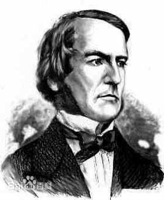
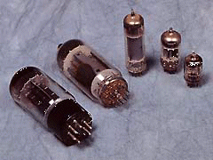
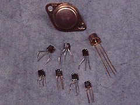
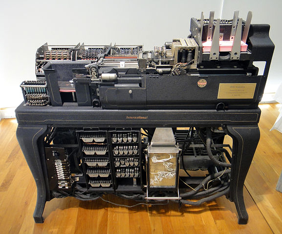
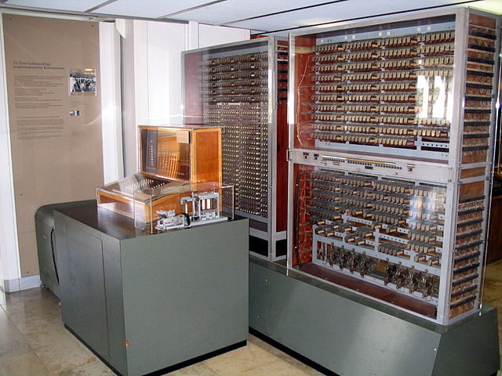
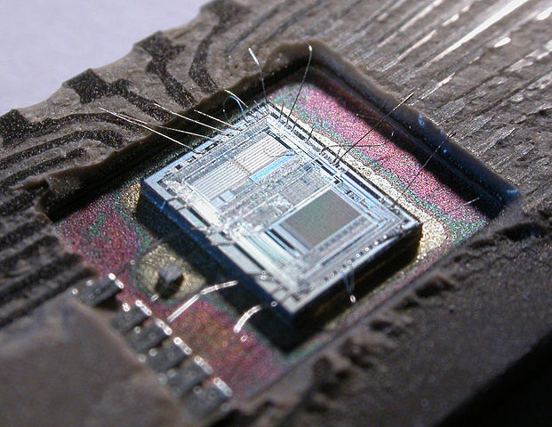

# 数字电子的发展史

Site : [computerhistory.org](http://www.computerhistory.org/timeline/)  
wiki : [History of Computer](https://en.wikipedia.org/wiki/History_of_computing_hardware)

1854年，英国数学家乔治布尔（George Boole，1815.11.2～1864）在他的杰出论文“思维规律的研究”一文中提出数字式电子系统中的信息用二元数--比特--表示，
一比特可以被认为是“0”或者“1”两个常量中的一个，这种只有两个数字元素的运算系统被称为二元系统，这个理论以用二元数“1”表示真，
“0”表示伪的概念为基础。直到八十四年以后香农根据布尔代数提出了开关理论，布尔的理论才找到实际的应用。

1906年，美国的Lee De Forest发明了电子管。在这之前造出数字电子计算机是不可能的。这为电子计算机的发展奠定了基础。

电子真空管  

晶体管  

1935年IBM 601 机，这是一台能在一秒内算出乘法的穿孔卡片计算机。 1939年11月美国John V.Atanasoff和他的学生Clifford Berry 
完成了一台16位的加法器，这是第一台真空管计算机。1939年Zuse和Schreyer开始在他们的Z1计算机的基础上发展Z2计算机，
并用继电器改进它的存储和计算单元。1940年Schreyer利用真空管完成了一个10位的加法器，并使用了氖灯做存储装置。

IBM 601   

1946年诞生了世界上第一台电子计算机，这表明人类创造了可增强和部分代替脑力劳动的工具。
它与人类在农业、工业社会中创造的那些只是增强体力劳动的工具相比，起了质的飞跃，为人类进入信息社会奠定了基础。
实际上数字系统的历史可追溯到17世纪，1624年Blaise Pascal 设计了一台机械的数值加法器，
在1671年，德国数学家Gorge Boole 发明了一台可进行乘法与除法的机器。但在这之前的计算机，都是基于机械运行方式，
尽管有个别产品开始引进一些电学内容，却都是从属于机械的，还没有进入计算机的灵活：逻辑运算领域。

世界上第一台电子计算机:Z3   

1958年，第一块集成电路研制成功，这是在电子设计方法上变革的开始。

从60年代开始，数字集成器件以双极型工艺制成了小规模逻辑器件。随后发展到中规模逻辑器件；

Intel 8742  

70年代末，微处理器的出现，使数字模拟电路的性能产生质的飞跃。数字集成器件所用的材料以硅材料为主，在高速电路中，
也使用化合物半导体材料，例如砷化镓等。逻辑门是数字电路中一种重要的逻辑单元电路。TTL逻辑门电路问世较早，其工艺经过不断改进，
至今仍为主要的基本逻辑器件之一。随着CMOS工艺的发展,TTL的主导地位受到了动摇，有被CMOS器件所取代的趋势。

近年来可编程逻辑器件PLD特别是现场可编程门阵列FPGA的飞速进步，使数字电子技术开创了新局面，不仅规模大，而且将硬件与软件相结合，
使器件的功能更加完善，使用更灵活。数字电路有很广泛的应用，这也是数字设计的重要性的体现，数字电路与数字电子技术广泛的应用于电视、
雷达、通信、电子计算机、自动控制、航天等科学技术领域。

20世纪30 年代，贝尔实验室的Claude Shannon 提出了现在用于数字逻辑设计的现代交换代数。

随着电子学的发展，从1947年半导体三极管的发明及真空管的诞生，到20世纪60年代集成电路的发明，都推动了数字逻辑和计算机的发展。
现代电子系统从1946年的计算机经典体系结构，20世纪70年代初英特尔设计出第一个微处理器，到现在最新一代的超级计算机，
数字系统正以惊人的速度稳步发展。仅仅针对计算机而言，发展至今已经经历以下四代：
1. 第一代（1946~1957年）是电子计算机，它的基本电子元件是电子管，内存储器采用水银延迟线，外存储器主要采用磁鼓、纸带、卡片、磁带等。 
2. 第二代（1958~1970年）是晶体管计算机。1948年，美国贝尔实验室发明了晶体管，10年后晶体管取代了计算机中的电子管，诞生了晶体管计算机。
3. 第三代（1963~1970年）是集成电路计算机。随着半导体技术的发展，1958年夏，美国德克萨斯公司制成了第一个半导体集成电路。 
4. 第四代（1971年~日前）是大规模集成电路计算机。随着集成了上千甚至上万个电子元件的大规模集成电路和超大规模集成电路的出现，电子计算机发展进入了第四代。