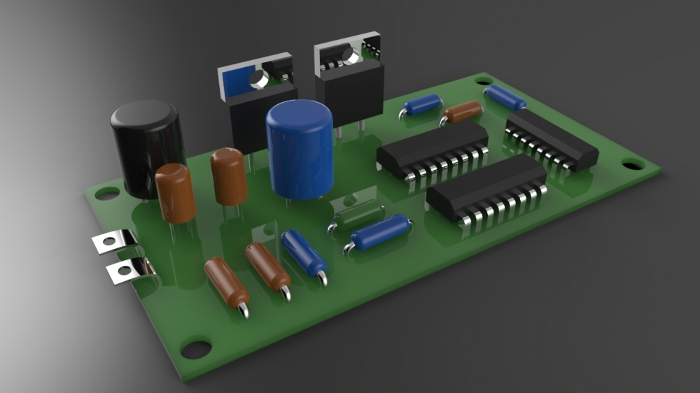
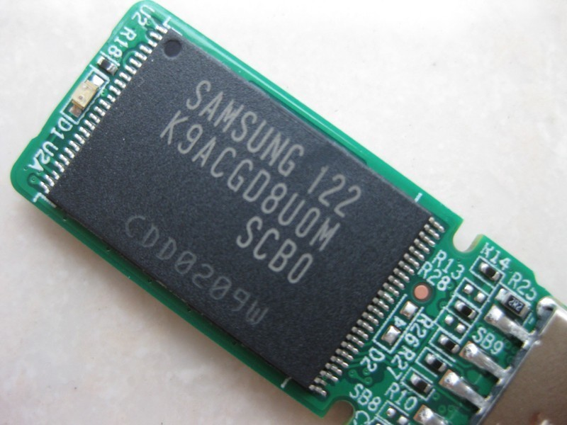
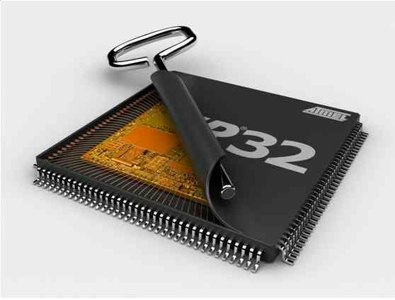

# Integrated Circuit - 集成电路

## 概念

集成电路（integrated circuit）是一种微型电子器件或部件。采用一定的工艺，把一个电路中所需的晶体管、
电阻、电容和电感等元件及布线互连一起，制作在一小块或几小块半导体晶片或介质基片上，然后封装在一个管壳内，
成为具有所需电路功能的微型结构；其中所有元件在结构上已组成一个整体，使电子元件向着微小型化、低功耗、智能化和高可靠性方面迈进了一大步。
它在电路中用字母“IC”表示。集成电路发明者为杰克·基尔比（基于锗（Ge）的集成电路）和罗伯特·诺伊思（基于硅（Si）的集成电路）。
当今半导体工业大多数应用的是基于硅的集成电路。

1942年在美国诞生的世界上第一台电子计算机，它是一个占地150平方米、重达30吨的庞然大物，里面的电路使用了17468只电子管、
7200只电阻、10000只电容、50万条线，耗电量150千瓦 。显然，占用面积大、无法移动是它最直观和突出的问题；
如果能把这些电子元件和连线集成在一小块载体上该有多好！我们相信，有很多人思考过这个问题，也提出过各种想法。
典型的如英国雷达研究所的科学家达默，他在1952年的一次会议上提出：可以把电子线路中的分立元器件，集中制作在一块半导体晶片上，
一小块晶片就是一个完整电路，这样一来，电子线路的体积就可大大缩小，可靠性大幅提高。这就是初期集成电路的构想，
晶体管的发明使这种想法成为了可能，1947年在美国贝尔实验室制造出来了第一个晶体管，而在此之前要实现电流放大功能只能依靠体积大、
耗电量大、结构脆弱的电子管。晶体管具有电子管的主要功能，并且克服了电子管的上述缺点，因此在晶体管发明后，
很快就出现了基于半导体的集成电路的构想，也就很快发明出来了集成电路。

分立器件

集成芯片

集成芯片内部

