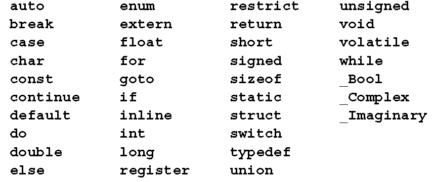
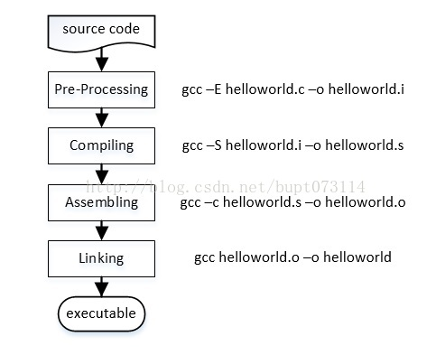

# C语言

## ANSI C

[ANSI C Document](resource/ansi-c.pdf)
	
## 关键字

## gcc 编译过程

[GccCompileSteps](http://blog.csdn.net/bupt073114/article/details/37049829)

1. 预处理（Pre-Processing）
2. 编译（compiling）
3. 汇编（Assembling）
4. 链接（Linking）

## 转义字符

|字符|对应数据类型|含义|
|:---|:---|:---|
|d / i	|int		    |接受整数值并将它表示为有符号的十进制整数，i是老式写法|
|o		|unsigned int	|无符号8进制整数(不输出前缀0)|
|u		|unsigned int	|无符号10进制整数|
|x / X	|unsigned int	|无符号16进制整数,x对应的是abcdef,X对应的是ABCDEF（不输出前缀0x)|
|f(lf)	|float(double)	|单精度浮点数用f,双精度浮点数用lf(尤其scanf不能混用)|
|e / E	|double			|科学计数法表示的数,此处"e"的大小写代表在输出时用的“e”的大小写|
|g / G	|double			|使用以上两种中最短的形式，大小写的使用同%e和%E|
|c		|char			|字符型。可以把输入的数字按照ASCII码相应转换为对应的字符|
|s / S	|char *			|字符串。|
|p		|void *			|以16进制形式输出指针|
|n		|int *			|到此字符之前为止，一共输出的字符个数，不输出文本|
|%		|无输入		 |不进行转换，输出字符‘%’（百分号）本身|
|m		|无			   |打印errno值对应的出错内容,(例: printf("%m\n"); )|

## 变量

变量命名
1. 由字母、下划线、数字组成；开头字母、下划线(不能用数字开头)。
2. 区分大小写。（tiger与Tiger为不同变量）
3. 不能与C语言的32个关键字相同

变量使用的注意事项
1. 未经定义，不能使用(先定义后使用)。
2. 一个变量被定义类型后，在编译时为其分配相应的存储单元
3. 便于编译时检查错误。不同类型的变量有不同的运算要求。
