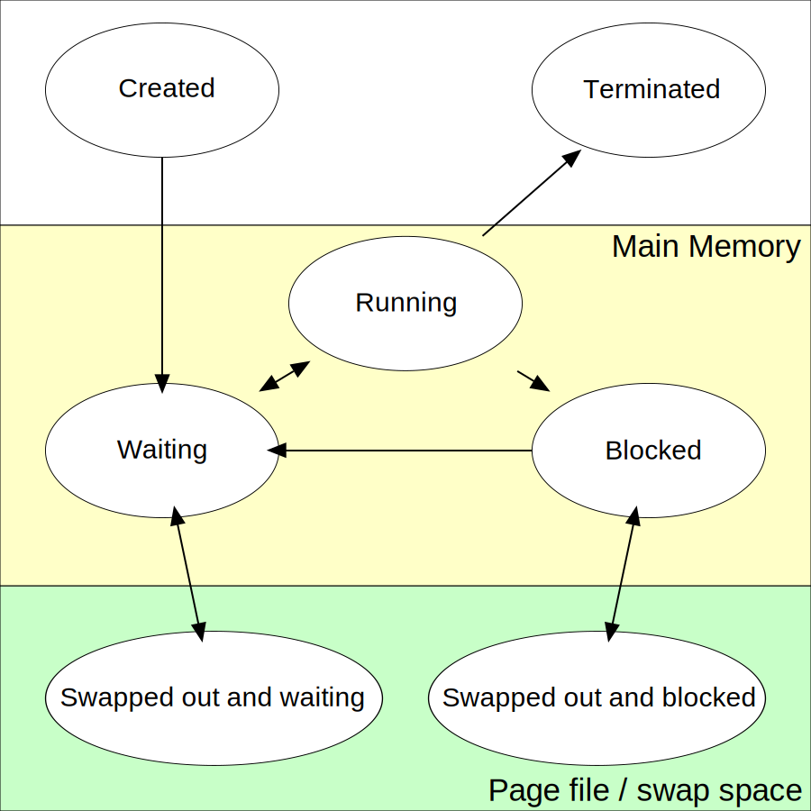

# Process 进程

## 概念

> 预备知识 [程序与操作系统](../Concepts/Program.md)
> 预备知识 [库](../Concepts/Library.md)

程序是躺在硬盘中的一个文件，将此文件复制到内存中跑起来，便成了活的程序，我们叫它进程(进行中的程序)。
CPU是个大忙人，他负责管理内存中的多个进程，可是它(保姆)每次只能处理一个进程(宝宝)的请求。

### 进程的状态

当CPU正在处理某个进程的请求时，这个进程就挺开心，这时的进程的状态叫做“运行态，Running”，旁边的进程就在那儿期待地
等着*换尿布*,我们叫这个等着的进程的状态叫“就绪态 Ready”.长时间不需要CPU处理的进程的状态叫做"阻塞态，Blocked"的请求。

这三种状态只是最基本的进程的状态，实际进程的状态很复杂，而且不同的操作系统上进程的状态种类也不一样。
进程的状态不是进程本身可以决定的，而是客观存在的。进程的状态通常是由进程和操作系统共同影响的。
比如说一个程序向操作系统发出了要求访问硬盘的请求(宝宝向保姆发出了向京东商城购买玩具的请求)，而这个操作需要耗费
较长的时间(快递第二天才能到)，CPU大人就去处理别的进程了，让这个进程在这儿阻塞着(宝宝等着)。



## getpid

getpid, getppid - get process identification

```
#include <sys/types.h>
#include <unistd.h>

pid_t getpid(void);
pid_t getppid(void);

```

## getuid

getuid, geteuid - get user identity

```
#include <unistd.h>
#include <sys/types.h>

uid_t getuid(void);
uid_t geteuid(void);
```

## getgid

getgid, getegid - get group identity

```
#include <unistd.h>
#include <sys/types.h>

gid_t getgid(void);
gid_t getegid(void);
```

## 特殊进程状态

**僵尸进程 Zombie Process**

子进程已经运行结束，但是父进程没有调用wait或waitpid函数回收子进程的资源是子进程变为僵尸进程的原因

**孤儿进程 Orphan Process**

父进程已经运行结束，但是子进程还活着

**守护进程 Daemon Process**

特殊的孤儿进程，系统中很多服务(在后台一直运行着)都是这种状态。
查看守护进程的命令

> ps –axj

