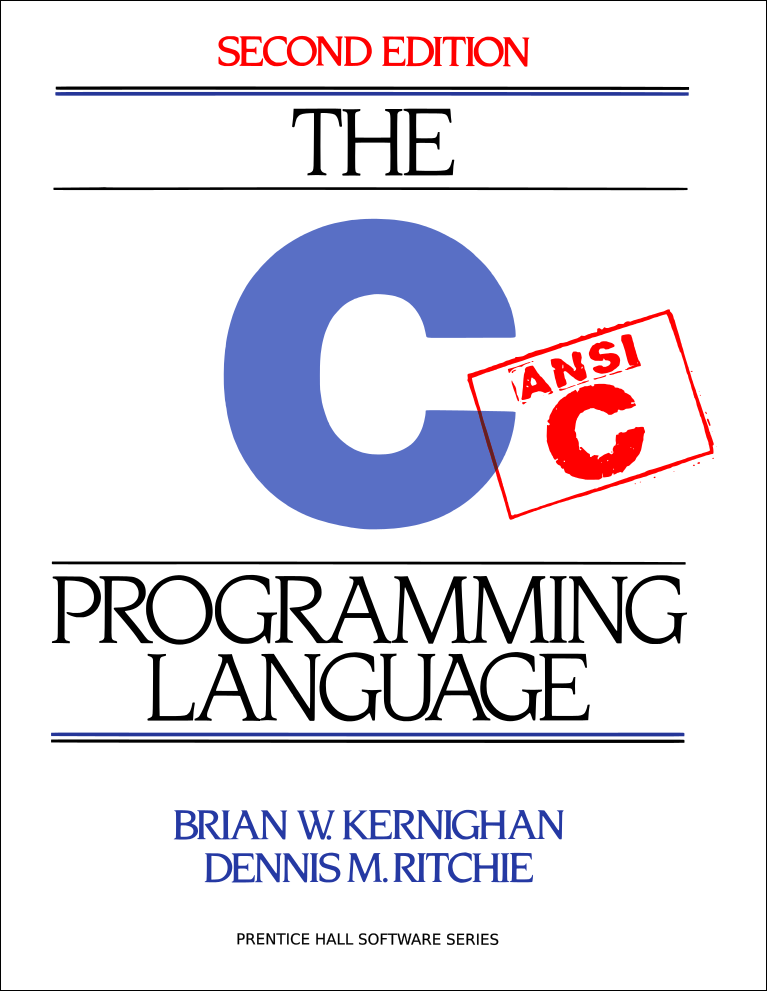

# C Language

## History

unix最初是用汇编语言写的,汇编语言可移植性不佳,为了增加unix的可移植性，Dennis Ritchie发明了C语言。
1972年，Version 2 unix 的绝大部分都是用C语言重写的。很快，不同的c compiler出现了，
unix 很快被移植到诸如 Honeywell 、 IBM System/370 等硬件设备上。  

1978年，Brian Kernighan 和 Dennis Ritchie(C语言发明者) 发布了第一版*The C Programming Language*。
这本被称作经典的"K&R"，广泛地流传在程序员之中，后来被定为 ANSI C 标准。   

## ANSI C and ISO C

1970年到1980年间，C语言被广泛地运用到各种架构的计算机上。
1983年，美国国家标准协会 American National Standards Institute (ANSI)，成立了一个叫作X3J11的委员会，
旨在建立一个C语言标准.

C 的第一个标准是由ANSI发布的。虽然这份文档后来被国际标准化组织(ISO)采纳并且ISO发布的修订版也被ANSI采纳了，
但名称ANSI C(而不是 ISO C)仍被广泛使用。一些软件开发者使用ISO C，还有一些使用 Standard C。

### C89
1983年，美国国家标准协会（ANSI）组成了一个委员会，X3J11，为了创立 C 语言的标准。经过漫长而艰苦的过程，
该标准于1989年完成，并在作为ANSI X3.159-1989 "Programming Language C"正式生效。因为这个标准是1989年发布的，
所以一般简称C89标准。有些人也把C89标准叫做ANSI C，因为这个标准是美国国家标准协会（ANSI）发布的。  

### C90
在1990年，ANSI C89标准被国际标准化组织(ISO)和国际电工委员会(IEC)采纳为国际标准，名叫ISO/IEC 9899:1990 - 
Programming languages -- C[2]  ，有些人简称C90标准。因此，C89和C90通常指同一个标准，一般更常用C89这种说法。  

### C99
在2000年3月，国际标准化组织(ISO)和国际电工委员会(IEC)采纳了第二个C语言标准，名叫ISO/IEC 9899:1999 - 
Programming languages -- C，简称C99标准。[3]   

### C11
在2011年12月，国际标准化组织(ISO)和国际电工委员会(IEC)采纳了第三个C语言标准，名叫ISO/IEC 9899:2011 - 
Information technology -- Programming languages -- C，简称C11标准。它是C程序语言的最新标准。 

### ANSI C and ISO C 的资料链接
C99 standard (current version of the C programming language):
[ISO/IEC C9899 PDF](http://www.open-std.org/jtc1/sc22/wg14/www/standards)\
[The C99 Draft (N869, 18 January, 1999)](https://busybox.net/~landley/c99-draft.html)

## GCC

GCC 原名为 GNU C 语言编译器（GNU C Compiler），因为它原本只能处理 C语言。GCC 很快地扩展，变得可处理 C++。
后来又扩展能够支持更多编程语言，如Fortran、Pascal、Objective-C、Java、Ada、Go以及各类处理器架构上的汇编语言等，
所以改名GNU编译器套件（GNU Compiler Collection）

GCC 是 GNU/Linux 操作系统上C语言的默认编译器。

GCC遵循ISO C标准。
> [ANSI](https://www.ansi.org/) C 发布了C89 (C 语言，1989年发布的标准)
> [ISO](http://www.iso.org/iso/home.htm)  C 发布了C99 (C 语言，1999年发布的标准)  
后来ANSI C 认同了 ISO C ,所以现在 ANSI C 和 ISO C 是一样的。   
这两种标准是要收费的，不过我们可以在其它网站上找到它们的草案，跟最终版很接近的啦！

[Open Standards](http://www.open-std.org/)
[ISO/IEC 9899 - Revision of the C standard](http://www.open-std.org/JTC1/SC22/WG14/www/docs/n1570.pdf)

[GCC-Document-PDF](/resource/gcc.pdf)

### GCC的资料链接
[GCC官网](http://gcc.gnu.org/)
[GCC文档](https://gcc.gnu.org/onlinedocs/)

