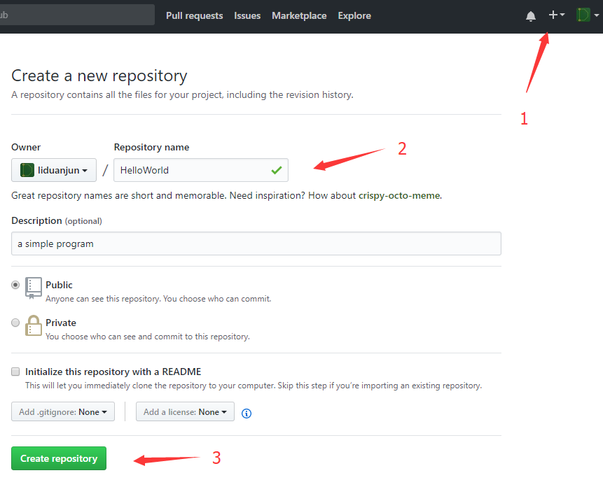
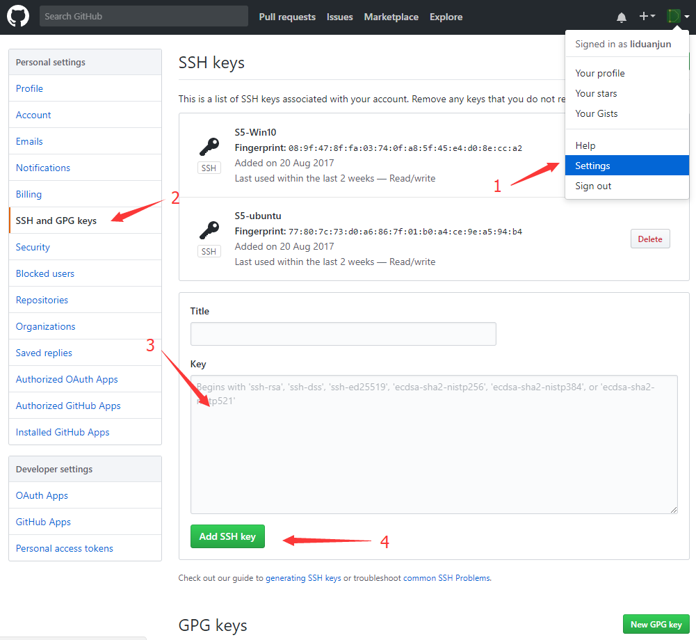
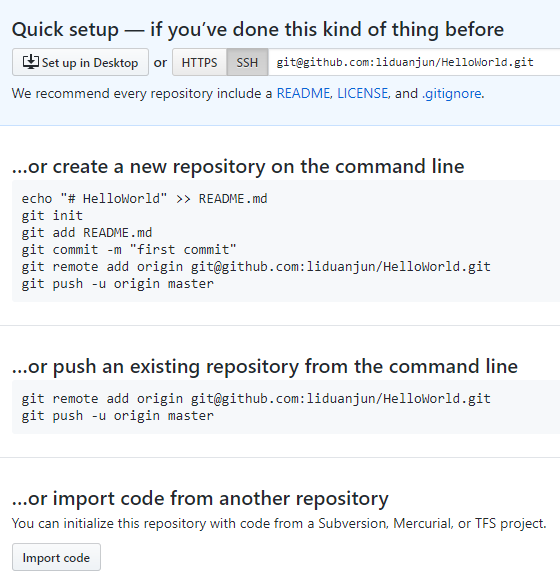

# Github 托管服务

gitHub是一个面向开源及私有软件项目的托管平台，因为只支持git 作为唯一的版本库格式进行托管，故名gitHub。

GitHub可以托管各种git库，并提供一个web界面，但与其它像 SourceForge或Google Code这样的服务不同，
GitHub的独特卖点在于从另外一个项目进行分支的简易性。
为一个项目贡献代码非常简单：首先点击项目站点的“fork”的按钮，然后将代码检出并将修改加入到刚才分出的代码库中，
最后通过内建的“pull request”机制向项目负责人申请代码合并。已经有人将GitHub称为代码玩家的MySpace。

## Github 的使用

### 在 Github 上创建一个项目

1. 点击 + 
2. 填写 Response 名称
3. 点击 Cteate response 按钮

### 在本地创建 SSH Key
1. 在Windows上打开 git bash 或 Linux 上打开 terminal
2. 输入 ssh-keygen -t rsa -C liduanjun@126.com
3. 按照提示完成创建 SSH Key

### 添加 SSH Key

1. 点击自己的头像，选择 Settings
2. 点击 SSH and GPG keys
3. 复制 ~/.ssh/id_rsa.pub 里的内容到文本框中
4. 点击 Add SSH Key

### 其它操作
